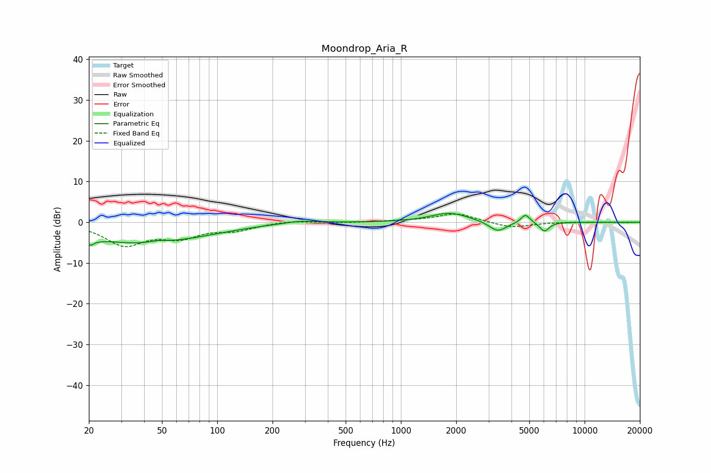

# Moondrop_Aria_R
See [usage instructions](https://github.com/jaakkopasanen/AutoEq#usage) for more options and info.

### Parametric EQs
Apply preamp of -2.3 dB when using parametric equalizer.

|   # | Type    |   Fc (Hz) |    Q |   Gain (dB) |
|-----|---------|-----------|------|-------------|
|   1 | Peaking |        21 | 5.12 |        -5   |
|   2 | Peaking |        21 | 5.93 |         3.2 |
|   3 | Peaking |        36 | 0.51 |        -4.6 |
|   4 | Peaking |        47 | 3.06 |         0.5 |
|   5 | Peaking |        81 | 0.63 |        -1.1 |
|   6 | Peaking |       283 | 1.5  |         0.7 |
|   7 | Peaking |      1844 | 1.37 |         2.3 |
|   8 | Peaking |      3371 | 2.95 |        -2.5 |
|   9 | Peaking |      4764 | 5.89 |         2.2 |
|  10 | Peaking |      6039 | 5.39 |        -2.3 |

### Fixed Band EQs
When using fixed band (also called graphic) equalizer, apply preamp of **-2.1 dB** (if available) and set gains manually with these parameters.

|   # | Type    |   Fc (Hz) |    Q |   Gain (dB) |
|-----|---------|-----------|------|-------------|
|   1 | Peaking |        31 | 1.41 |        -5.3 |
|   2 | Peaking |        62 | 1.41 |        -3.2 |
|   3 | Peaking |       125 | 1.41 |        -1.7 |
|   4 | Peaking |       250 | 1.41 |         0.5 |
|   5 | Peaking |       500 | 1.41 |        -0.1 |
|   6 | Peaking |      1000 | 1.41 |         0.2 |
|   7 | Peaking |      2000 | 1.41 |         2.2 |
|   8 | Peaking |      4000 | 1.41 |        -1.4 |
|   9 | Peaking |      8000 | 1.41 |         0.1 |
|  10 | Peaking |     16000 | 1.41 |        -0.1 |

### Graphs

