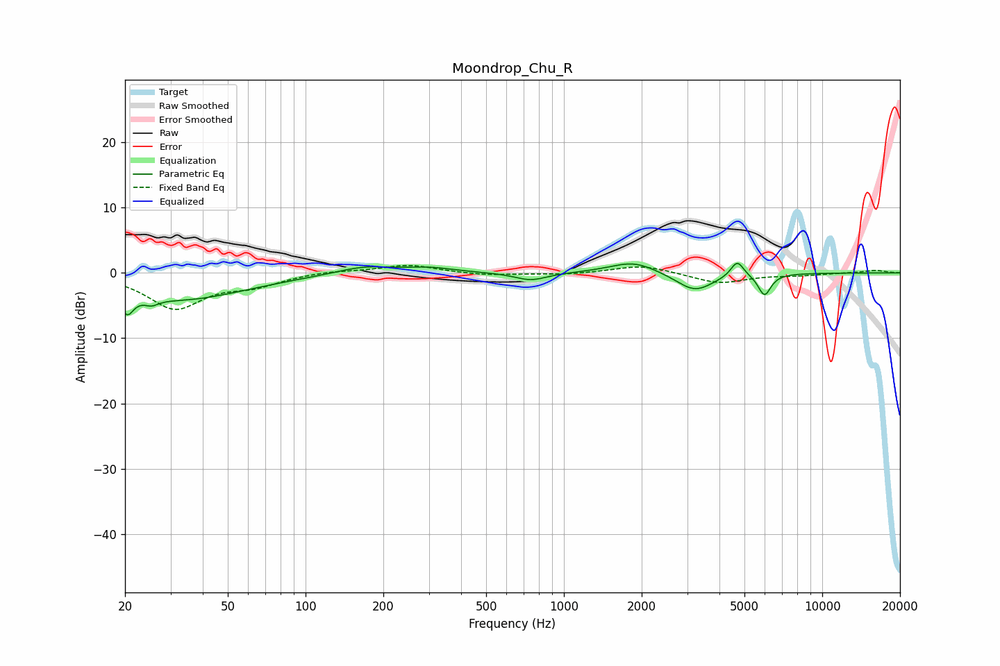

# Moondrop_Chu_R
See [usage instructions](https://github.com/jaakkopasanen/AutoEq#usage) for more options and info.

### Parametric EQs
Apply preamp of -1.6 dB when using parametric equalizer.

|   # | Type    |   Fc (Hz) |    Q |   Gain (dB) |
|-----|---------|-----------|------|-------------|
|   1 | Peaking |        20 | 5.73 |        -3.2 |
|   2 | Peaking |        25 | 5.2  |        -0.9 |
|   3 | Peaking |        33 | 0.56 |        -4   |
|   4 | Peaking |       169 | 1.29 |         1.2 |
|   5 | Peaking |       301 | 1.49 |         0.7 |
|   6 | Peaking |       745 | 2.22 |        -1.2 |
|   7 | Peaking |      1859 | 1.56 |         1.8 |
|   8 | Peaking |      3211 | 1.95 |        -2.9 |
|   9 | Peaking |      4690 | 5.62 |         2.5 |
|  10 | Peaking |      5979 | 5.64 |        -3.3 |

### Fixed Band EQs
When using fixed band (also called graphic) equalizer, apply preamp of **-1.2 dB** (if available) and set gains manually with these parameters.

|   # | Type    |   Fc (Hz) |    Q |   Gain (dB) |
|-----|---------|-----------|------|-------------|
|   1 | Peaking |        31 | 1.41 |        -5.3 |
|   2 | Peaking |        62 | 1.41 |        -1.7 |
|   3 | Peaking |       125 | 1.41 |         0.4 |
|   4 | Peaking |       250 | 1.41 |         1.2 |
|   5 | Peaking |       500 | 1.41 |        -0.4 |
|   6 | Peaking |      1000 | 1.41 |        -0.3 |
|   7 | Peaking |      2000 | 1.41 |         1.2 |
|   8 | Peaking |      4000 | 1.41 |        -1.6 |
|   9 | Peaking |      8000 | 1.41 |        -0.3 |
|  10 | Peaking |     16000 | 1.41 |         0.4 |

### Graphs

