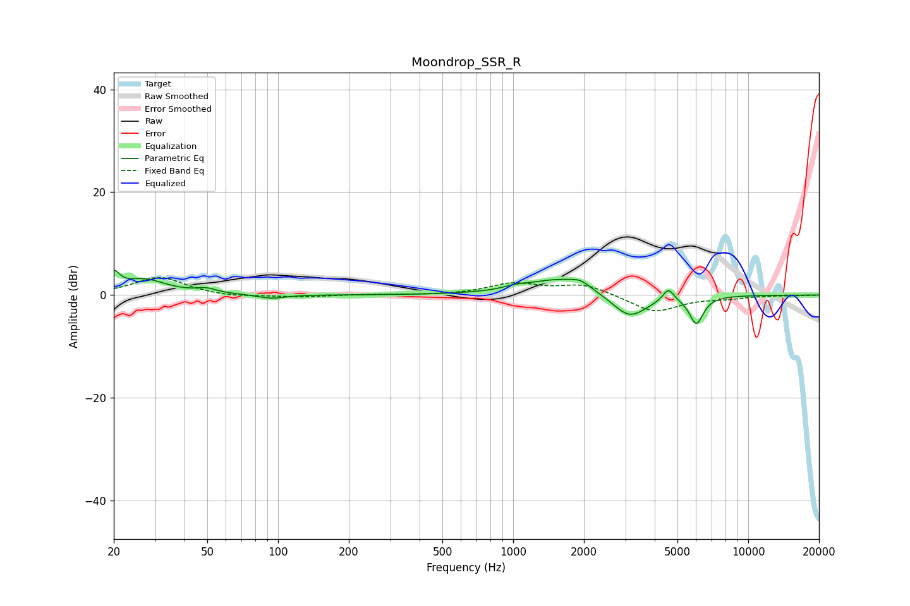

# Moondrop_SSR_R
See [usage instructions](https://github.com/jaakkopasanen/AutoEq#usage) for more options and info.

### Parametric EQs
Apply preamp of -4.9 dB when using parametric equalizer.

|   # | Type    |   Fc (Hz) |    Q |   Gain (dB) |
|-----|---------|-----------|------|-------------|
|   1 | Peaking |        20 | 5.98 |         3.2 |
|   2 | Peaking |        27 | 1.48 |         2.9 |
|   3 | Peaking |        50 | 3.34 |         0.8 |
|   4 | Peaking |        94 | 2.46 |        -0.8 |
|   5 | Peaking |      1021 | 2.91 |         0.5 |
|   6 | Peaking |      1577 | 1.01 |         3.2 |
|   7 | Peaking |      1937 | 3.42 |         1.1 |
|   8 | Peaking |      3127 | 1.88 |        -4.7 |
|   9 | Peaking |      4574 | 6    |         2.5 |
|  10 | Peaking |      6016 | 4.66 |        -5.4 |

### Fixed Band EQs
When using fixed band (also called graphic) equalizer, apply preamp of **-3.5 dB** (if available) and set gains manually with these parameters.

|   # | Type    |   Fc (Hz) |    Q |   Gain (dB) |
|-----|---------|-----------|------|-------------|
|   1 | Peaking |        31 | 1.41 |         3.5 |
|   2 | Peaking |        62 | 1.41 |        -0.5 |
|   3 | Peaking |       125 | 1.41 |        -0.4 |
|   4 | Peaking |       250 | 1.41 |         0.1 |
|   5 | Peaking |       500 | 1.41 |        -0.1 |
|   6 | Peaking |      1000 | 1.41 |         2.1 |
|   7 | Peaking |      2000 | 1.41 |         2.1 |
|   8 | Peaking |      4000 | 1.41 |        -3.4 |
|   9 | Peaking |      8000 | 1.41 |        -0.5 |
|  10 | Peaking |     16000 | 1.41 |        -0.1 |

### Graphs

