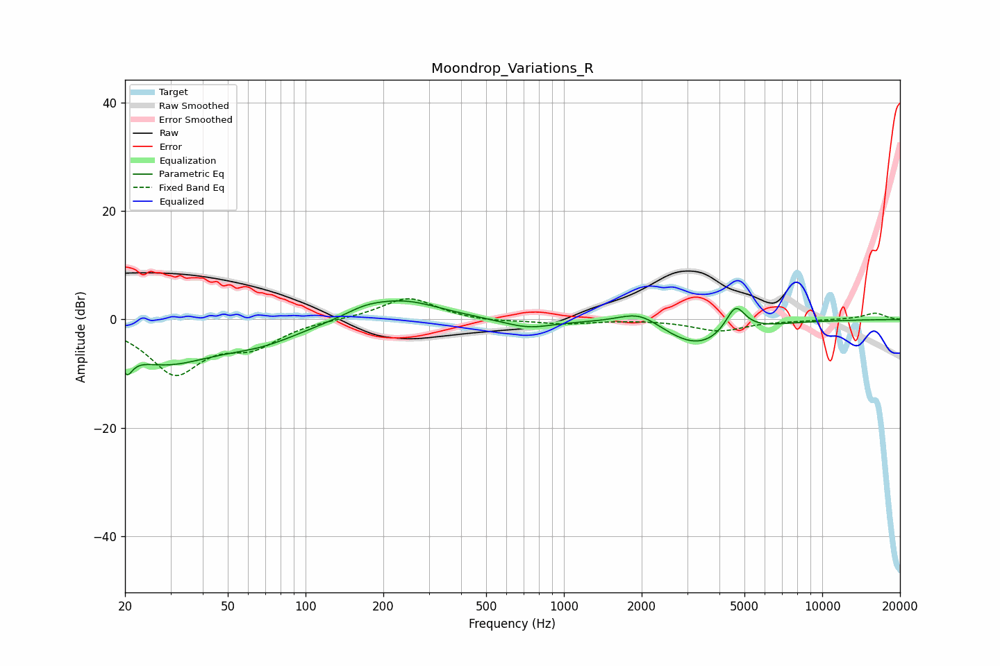

# Moondrop_Variations_R
See [usage instructions](https://github.com/jaakkopasanen/AutoEq#usage) for more options and info.

### Parametric EQs
Apply preamp of -3.5 dB when using parametric equalizer.

|   # | Type    |   Fc (Hz) |    Q |   Gain (dB) |
|-----|---------|-----------|------|-------------|
|   1 | Peaking |        20 | 5.01 |         3.8 |
|   2 | Peaking |        20 | 5.63 |        -7.6 |
|   3 | Peaking |        28 | 0.7  |        -7.5 |
|   4 | Peaking |        68 | 0.89 |        -2.8 |
|   5 | Peaking |       169 | 1.73 |         1.3 |
|   6 | Peaking |       239 | 0.97 |         3.5 |
|   7 | Peaking |       726 | 1.45 |        -1.7 |
|   8 | Peaking |      1968 | 1.69 |         2.8 |
|   9 | Peaking |      3309 | 1    |        -5.3 |
|  10 | Peaking |      4614 | 3.58 |         5.3 |

### Fixed Band EQs
When using fixed band (also called graphic) equalizer, apply preamp of **-3.9 dB** (if available) and set gains manually with these parameters.

|   # | Type    |   Fc (Hz) |    Q |   Gain (dB) |
|-----|---------|-----------|------|-------------|
|   1 | Peaking |        31 | 1.41 |        -9.6 |
|   2 | Peaking |        62 | 1.41 |        -4.1 |
|   3 | Peaking |       125 | 1.41 |         0.1 |
|   4 | Peaking |       250 | 1.41 |         4.2 |
|   5 | Peaking |       500 | 1.41 |        -0.5 |
|   6 | Peaking |      1000 | 1.41 |        -0.8 |
|   7 | Peaking |      2000 | 1.41 |         0   |
|   8 | Peaking |      4000 | 1.41 |        -2.1 |
|   9 | Peaking |      8000 | 1.41 |        -0.1 |
|  10 | Peaking |     16000 | 1.41 |         1.2 |

### Graphs

