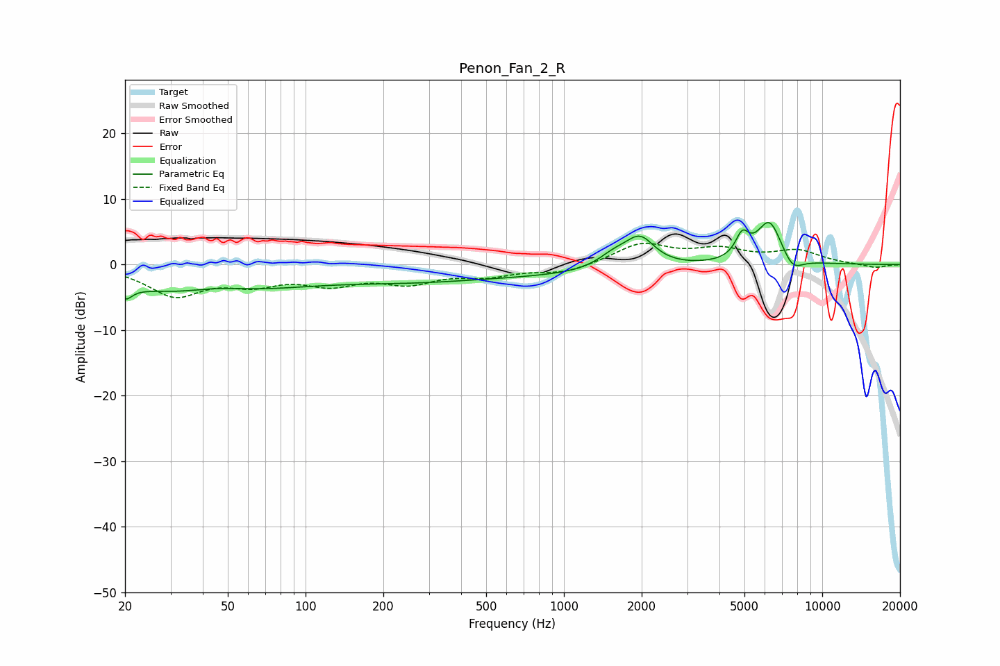

# Penon_Fan_2_R
See [usage instructions](https://github.com/jaakkopasanen/AutoEq#usage) for more options and info.

### Parametric EQs
Apply preamp of -6.5 dB when using parametric equalizer.

|   # | Type    |   Fc (Hz) |    Q |   Gain (dB) |
|-----|---------|-----------|------|-------------|
|   1 | Peaking |        20 | 5.61 |        -1.8 |
|   2 | Peaking |        38 | 0.41 |        -4.6 |
|   3 | Peaking |        45 | 1.12 |         1.2 |
|   4 | Peaking |       258 | 0.6  |        -0.7 |
|   5 | Peaking |       476 | 0.22 |        -1.8 |
|   6 | Peaking |      1564 | 2.23 |         1.9 |
|   7 | Peaking |      1972 | 2.46 |         4.4 |
|   8 | Peaking |      4901 | 5.4  |         3.3 |
|   9 | Peaking |      6252 | 2.71 |         6.8 |
|  10 | Peaking |      7652 | 3.29 |        -2.4 |

### Fixed Band EQs
When using fixed band (also called graphic) equalizer, apply preamp of **-3.3 dB** (if available) and set gains manually with these parameters.

|   # | Type    |   Fc (Hz) |    Q |   Gain (dB) |
|-----|---------|-----------|------|-------------|
|   1 | Peaking |        31 | 1.41 |        -4.5 |
|   2 | Peaking |        62 | 1.41 |        -2.4 |
|   3 | Peaking |       125 | 1.41 |        -2.5 |
|   4 | Peaking |       250 | 1.41 |        -2.4 |
|   5 | Peaking |       500 | 1.41 |        -1.5 |
|   6 | Peaking |      1000 | 1.41 |        -1.3 |
|   7 | Peaking |      2000 | 1.41 |         3.1 |
|   8 | Peaking |      4000 | 1.41 |         2   |
|   9 | Peaking |      8000 | 1.41 |         2   |
|  10 | Peaking |     16000 | 1.41 |        -0.5 |

### Graphs

