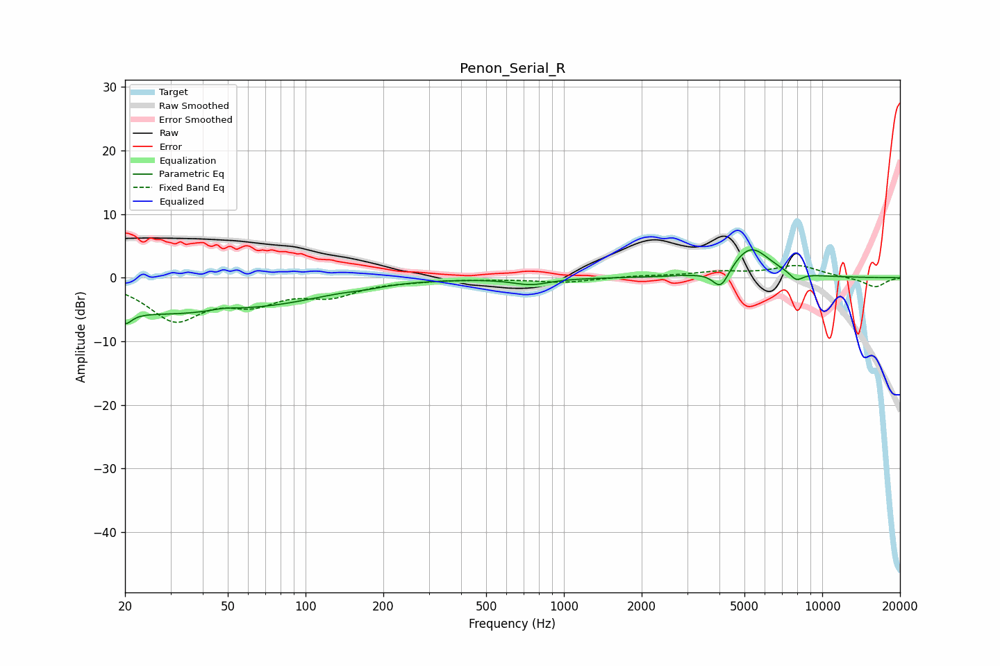

# Penon_Serial_R
See [usage instructions](https://github.com/jaakkopasanen/AutoEq#usage) for more options and info.

### Parametric EQs
Apply preamp of -4.5 dB when using parametric equalizer.

|   # | Type    |   Fc (Hz) |    Q |   Gain (dB) |
|-----|---------|-----------|------|-------------|
|   1 | Peaking |        20 | 5.48 |         3.5 |
|   2 | Peaking |        20 | 5.46 |        -5.5 |
|   3 | Peaking |        27 | 0.38 |        -5.3 |
|   4 | Peaking |        48 | 3.08 |         0.4 |
|   5 | Peaking |        87 | 0.73 |        -1.5 |
|   6 | Peaking |       171 | 2.02 |        -0.4 |
|   7 | Peaking |       746 | 2    |        -1   |
|   8 | Peaking |      4054 | 4.39 |        -3.3 |
|   9 | Peaking |      5283 | 1.86 |         4.9 |
|  10 | Peaking |      7936 | 5.13 |        -1.3 |

### Fixed Band EQs
When using fixed band (also called graphic) equalizer, apply preamp of **-2.0 dB** (if available) and set gains manually with these parameters.

|   # | Type    |   Fc (Hz) |    Q |   Gain (dB) |
|-----|---------|-----------|------|-------------|
|   1 | Peaking |        31 | 1.41 |        -6.3 |
|   2 | Peaking |        62 | 1.41 |        -3.2 |
|   3 | Peaking |       125 | 1.41 |        -2.5 |
|   4 | Peaking |       250 | 1.41 |        -0.3 |
|   5 | Peaking |       500 | 1.41 |        -0.1 |
|   6 | Peaking |      1000 | 1.41 |        -0.7 |
|   7 | Peaking |      2000 | 1.41 |         0.3 |
|   8 | Peaking |      4000 | 1.41 |         0.8 |
|   9 | Peaking |      8000 | 1.41 |         1.9 |
|  10 | Peaking |     16000 | 1.41 |        -1.5 |

### Graphs

