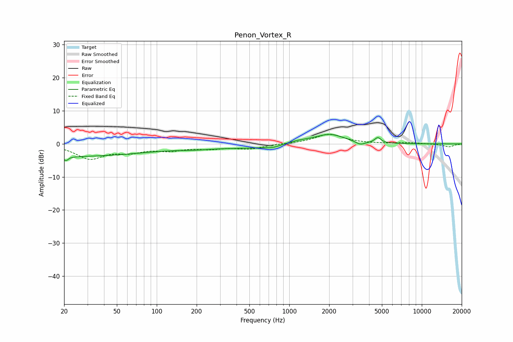

# Penon_Vortex_R
See [usage instructions](https://github.com/jaakkopasanen/AutoEq#usage) for more options and info.

### Parametric EQs
Apply preamp of -2.9 dB when using parametric equalizer.

|   # | Type    |   Fc (Hz) |    Q |   Gain (dB) |
|-----|---------|-----------|------|-------------|
|   1 | Peaking |        21 | 5.9  |        -4.3 |
|   2 | Peaking |        21 | 6    |         3.1 |
|   3 | Peaking |        23 | 0.22 |        -3.7 |
|   4 | Peaking |       194 | 0.99 |        -0.7 |
|   5 | Peaking |       636 | 0.49 |        -1.3 |
|   6 | Peaking |       753 | 2.79 |        -0.5 |
|   7 | Peaking |      1158 | 1.18 |         1.3 |
|   8 | Peaking |      2028 | 1.31 |         2.9 |
|   9 | Peaking |      3442 | 4.14 |        -1   |
|  10 | Peaking |      4657 | 6    |         1.7 |

### Fixed Band EQs
When using fixed band (also called graphic) equalizer, apply preamp of **-3.0 dB** (if available) and set gains manually with these parameters.

|   # | Type    |   Fc (Hz) |    Q |   Gain (dB) |
|-----|---------|-----------|------|-------------|
|   1 | Peaking |        31 | 1.41 |        -4.3 |
|   2 | Peaking |        62 | 1.41 |        -2   |
|   3 | Peaking |       125 | 1.41 |        -1.6 |
|   4 | Peaking |       250 | 1.41 |        -1.2 |
|   5 | Peaking |       500 | 1.41 |        -1.4 |
|   6 | Peaking |      1000 | 1.41 |         0.1 |
|   7 | Peaking |      2000 | 1.41 |         2.9 |
|   8 | Peaking |      4000 | 1.41 |         0   |
|   9 | Peaking |      8000 | 1.41 |         0.3 |
|  10 | Peaking |     16000 | 1.41 |        -0.9 |

### Graphs

