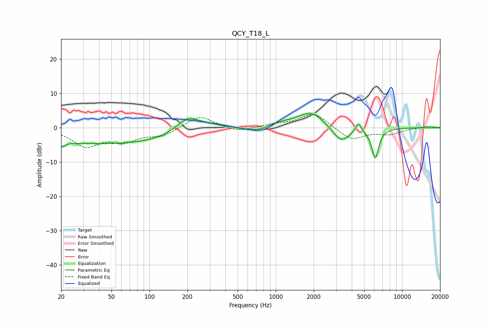

# QCY_T18_L
See [usage instructions](https://github.com/jaakkopasanen/AutoEq#usage) for more options and info.

### Parametric EQs
Apply preamp of -4.2 dB when using parametric equalizer.

|   # | Type    |   Fc (Hz) |    Q |   Gain (dB) |
|-----|---------|-----------|------|-------------|
|   1 | Peaking |        20 | 4.73 |        -1.6 |
|   2 | Peaking |        55 | 0.18 |        -4.8 |
|   3 | Peaking |       199 | 1.54 |         4   |
|   4 | Peaking |       279 | 0.74 |         2.5 |
|   5 | Peaking |       753 | 1.2  |        -1.8 |
|   6 | Peaking |      1020 | 1.43 |         1.6 |
|   7 | Peaking |      1910 | 1.28 |         4.8 |
|   8 | Peaking |      3284 | 2    |        -4.8 |
|   9 | Peaking |      4510 | 6    |         2.8 |
|  10 | Peaking |      6126 | 4.88 |        -8.8 |

### Fixed Band EQs
When using fixed band (also called graphic) equalizer, apply preamp of **-3.9 dB** (if available) and set gains manually with these parameters.

|   # | Type    |   Fc (Hz) |    Q |   Gain (dB) |
|-----|---------|-----------|------|-------------|
|   1 | Peaking |        31 | 1.41 |        -5.1 |
|   2 | Peaking |        62 | 1.41 |        -3.4 |
|   3 | Peaking |       125 | 1.41 |        -2.3 |
|   4 | Peaking |       250 | 1.41 |         3.7 |
|   5 | Peaking |       500 | 1.41 |        -1.3 |
|   6 | Peaking |      1000 | 1.41 |         0.8 |
|   7 | Peaking |      2000 | 1.41 |         4.4 |
|   8 | Peaking |      4000 | 1.41 |        -3.6 |
|   9 | Peaking |      8000 | 1.41 |        -1.7 |
|  10 | Peaking |     16000 | 1.41 |         0.5 |

### Graphs

