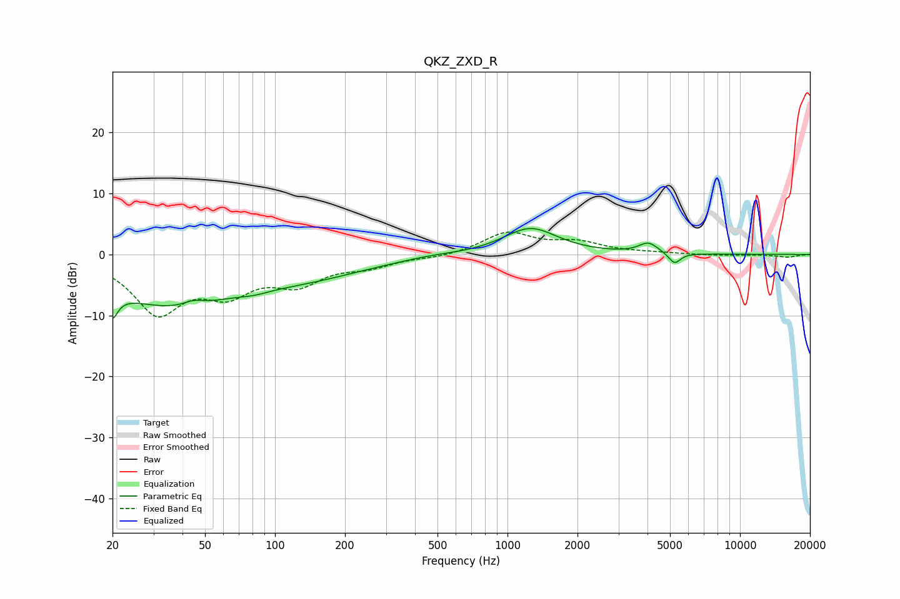

# QKZ_ZXD_R
See [usage instructions](https://github.com/jaakkopasanen/AutoEq#usage) for more options and info.

### Parametric EQs
Apply preamp of -4.3 dB when using parametric equalizer.

|   # | Type    |   Fc (Hz) |    Q |   Gain (dB) |
|-----|---------|-----------|------|-------------|
|   1 | Peaking |        20 | 5.35 |        -8.1 |
|   2 | Peaking |        20 | 5.17 |         3.7 |
|   3 | Peaking |        35 | 0.48 |        -7.9 |
|   4 | Peaking |        45 | 3.27 |         0.8 |
|   5 | Peaking |        82 | 2.46 |        -0.5 |
|   6 | Peaking |       141 | 0.53 |        -2.8 |
|   7 | Peaking |       466 | 1.43 |         0.3 |
|   8 | Peaking |      1253 | 1.22 |         4.4 |
|   9 | Peaking |      4037 | 3.45 |         1.7 |
|  10 | Peaking |      5229 | 5.48 |        -1.8 |

### Fixed Band EQs
When using fixed band (also called graphic) equalizer, apply preamp of **-3.7 dB** (if available) and set gains manually with these parameters.

|   # | Type    |   Fc (Hz) |    Q |   Gain (dB) |
|-----|---------|-----------|------|-------------|
|   1 | Peaking |        31 | 1.41 |        -9.1 |
|   2 | Peaking |        62 | 1.41 |        -5.2 |
|   3 | Peaking |       125 | 1.41 |        -4.1 |
|   4 | Peaking |       250 | 1.41 |        -1.6 |
|   5 | Peaking |       500 | 1.41 |        -0.5 |
|   6 | Peaking |      1000 | 1.41 |         3.5 |
|   7 | Peaking |      2000 | 1.41 |         1.8 |
|   8 | Peaking |      4000 | 1.41 |         0.2 |
|   9 | Peaking |      8000 | 1.41 |        -0.2 |
|  10 | Peaking |     16000 | 1.41 |        -0.5 |

### Graphs

