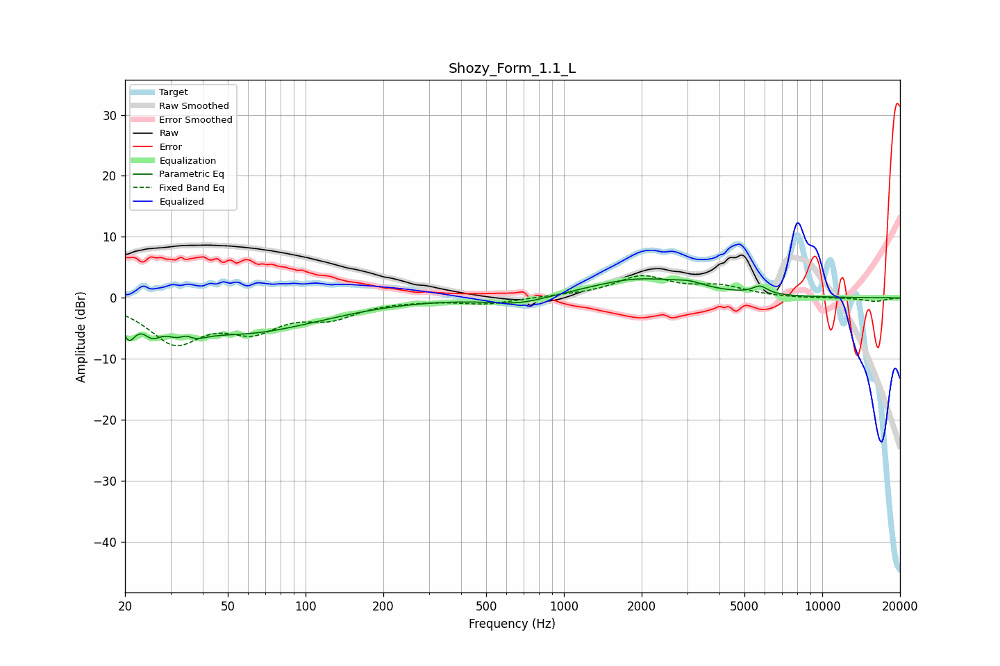

# Shozy_Form_1.1_L
See [usage instructions](https://github.com/jaakkopasanen/AutoEq#usage) for more options and info.

### Parametric EQs
Apply preamp of -3.2 dB when using parametric equalizer.

|   # | Type    |   Fc (Hz) |    Q |   Gain (dB) |
|-----|---------|-----------|------|-------------|
|   1 | Peaking |        21 | 5.71 |        -4.1 |
|   2 | Peaking |        25 | 4.34 |        -2.4 |
|   3 | Peaking |        34 | 2.94 |        -6.2 |
|   4 | Peaking |        34 | 4.3  |         4.3 |
|   5 | Peaking |        55 | 0.57 |        -4.9 |
|   6 | Peaking |       107 | 0.63 |        -1   |
|   7 | Peaking |       670 | 1.24 |        -1.3 |
|   8 | Peaking |      1958 | 0.73 |         3.1 |
|   9 | Peaking |      3052 | 2.56 |         0.7 |
|  10 | Peaking |      5744 | 4.72 |         1.3 |

### Fixed Band EQs
When using fixed band (also called graphic) equalizer, apply preamp of **-3.7 dB** (if available) and set gains manually with these parameters.

|   # | Type    |   Fc (Hz) |    Q |   Gain (dB) |
|-----|---------|-----------|------|-------------|
|   1 | Peaking |        31 | 1.41 |        -6.9 |
|   2 | Peaking |        62 | 1.41 |        -4.4 |
|   3 | Peaking |       125 | 1.41 |        -2.7 |
|   4 | Peaking |       250 | 1.41 |        -0.2 |
|   5 | Peaking |       500 | 1.41 |        -1   |
|   6 | Peaking |      1000 | 1.41 |         0.2 |
|   7 | Peaking |      2000 | 1.41 |         3.4 |
|   8 | Peaking |      4000 | 1.41 |         1.7 |
|   9 | Peaking |      8000 | 1.41 |        -0.1 |
|  10 | Peaking |     16000 | 1.41 |        -0.6 |

### Graphs

