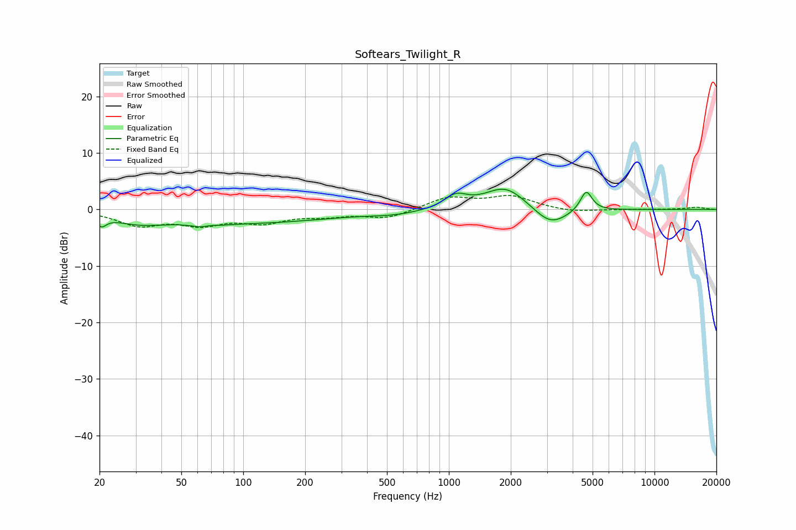

# Softears_Twilight_R
See [usage instructions](https://github.com/jaakkopasanen/AutoEq#usage) for more options and info.

### Parametric EQs
Apply preamp of -3.7 dB when using parametric equalizer.

|   # | Type    |   Fc (Hz) |    Q |   Gain (dB) |
|-----|---------|-----------|------|-------------|
|   1 | Peaking |        20 | 5.81 |        -1.7 |
|   2 | Peaking |        31 | 1.13 |        -1.6 |
|   3 | Peaking |        67 | 2.78 |        -2.8 |
|   4 | Peaking |        68 | 3.21 |         2.3 |
|   5 | Peaking |       105 | 0.35 |        -2.3 |
|   6 | Peaking |       544 | 1.09 |        -0.7 |
|   7 | Peaking |      1081 | 2.58 |         2.2 |
|   8 | Peaking |      1887 | 1.39 |         4.1 |
|   9 | Peaking |      3124 | 1.71 |        -3.3 |
|  10 | Peaking |      4654 | 4.88 |         3.6 |

### Fixed Band EQs
When using fixed band (also called graphic) equalizer, apply preamp of **-2.6 dB** (if available) and set gains manually with these parameters.

|   # | Type    |   Fc (Hz) |    Q |   Gain (dB) |
|-----|---------|-----------|------|-------------|
|   1 | Peaking |        31 | 1.41 |        -2.6 |
|   2 | Peaking |        62 | 1.41 |        -2.3 |
|   3 | Peaking |       125 | 1.41 |        -2   |
|   4 | Peaking |       250 | 1.41 |        -0.9 |
|   5 | Peaking |       500 | 1.41 |        -1.5 |
|   6 | Peaking |      1000 | 1.41 |         2.1 |
|   7 | Peaking |      2000 | 1.41 |         2.2 |
|   8 | Peaking |      4000 | 1.41 |        -0.5 |
|   9 | Peaking |      8000 | 1.41 |        -0   |
|  10 | Peaking |     16000 | 1.41 |         0.4 |

### Graphs

