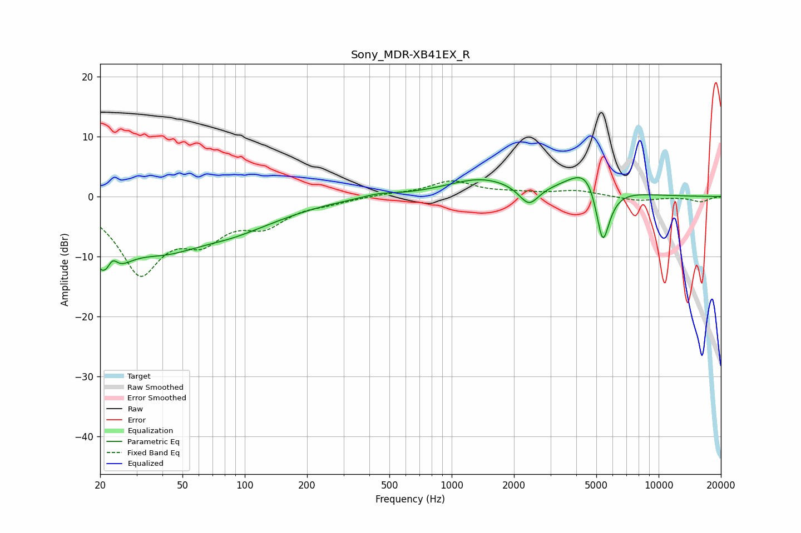

# Sony_MDR-XB41EX_R
See [usage instructions](https://github.com/jaakkopasanen/AutoEq#usage) for more options and info.

### Parametric EQs
Apply preamp of -3.2 dB when using parametric equalizer.

|   # | Type    |   Fc (Hz) |    Q |   Gain (dB) |
|-----|---------|-----------|------|-------------|
|   1 | Peaking |        22 | 1.71 |       -10.8 |
|   2 | Peaking |        23 | 5.13 |         3.6 |
|   3 | Peaking |        41 | 0.7  |        -6.7 |
|   4 | Peaking |        84 | 0.82 |        -2.5 |
|   5 | Peaking |       128 | 0.65 |        -1.6 |
|   6 | Peaking |       446 | 1.77 |         0.6 |
|   7 | Peaking |      1393 | 0.84 |         2.9 |
|   8 | Peaking |      2363 | 2.99 |        -3.3 |
|   9 | Peaking |      4710 | 1.51 |         7.2 |
|  10 | Peaking |      5360 | 3.44 |       -13   |

### Fixed Band EQs
When using fixed band (also called graphic) equalizer, apply preamp of **-2.7 dB** (if available) and set gains manually with these parameters.

|   # | Type    |   Fc (Hz) |    Q |   Gain (dB) |
|-----|---------|-----------|------|-------------|
|   1 | Peaking |        31 | 1.41 |       -12.1 |
|   2 | Peaking |        62 | 1.41 |        -5.5 |
|   3 | Peaking |       125 | 1.41 |        -4   |
|   4 | Peaking |       250 | 1.41 |        -0.7 |
|   5 | Peaking |       500 | 1.41 |         0.4 |
|   6 | Peaking |      1000 | 1.41 |         2.5 |
|   7 | Peaking |      2000 | 1.41 |         0.5 |
|   8 | Peaking |      4000 | 1.41 |         0.9 |
|   9 | Peaking |      8000 | 1.41 |        -0.7 |
|  10 | Peaking |     16000 | 1.41 |        -0.9 |

### Graphs

