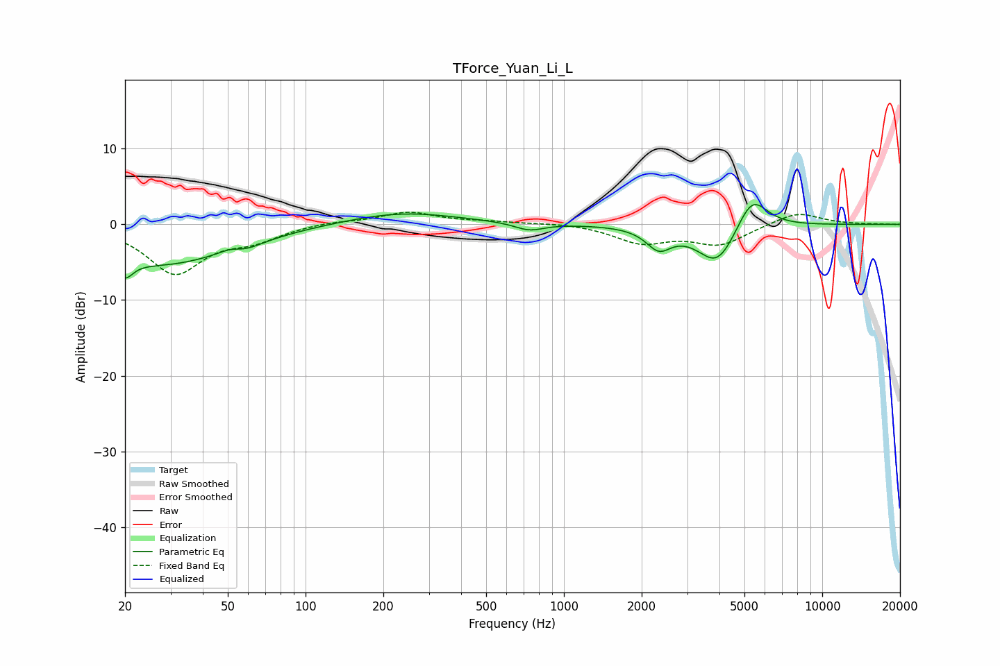

# TForce_Yuan_Li_L
See [usage instructions](https://github.com/jaakkopasanen/AutoEq#usage) for more options and info.

### Parametric EQs
Apply preamp of -2.7 dB when using parametric equalizer.

|   # | Type    |   Fc (Hz) |    Q |   Gain (dB) |
|-----|---------|-----------|------|-------------|
|   1 | Peaking |        20 | 5.3  |        -5.7 |
|   2 | Peaking |        20 | 5.94 |         3.2 |
|   3 | Peaking |        28 | 0.51 |        -5.2 |
|   4 | Peaking |        51 | 3.25 |         0.6 |
|   5 | Peaking |        58 | 2.25 |        -0.8 |
|   6 | Peaking |       235 | 0.64 |         1.7 |
|   7 | Peaking |       735 | 2.52 |        -1   |
|   8 | Peaking |      2330 | 2.91 |        -2.7 |
|   9 | Peaking |      3927 | 1.82 |        -5.5 |
|  10 | Peaking |      5333 | 2.27 |         4.8 |

### Fixed Band EQs
When using fixed band (also called graphic) equalizer, apply preamp of **-1.7 dB** (if available) and set gains manually with these parameters.

|   # | Type    |   Fc (Hz) |    Q |   Gain (dB) |
|-----|---------|-----------|------|-------------|
|   1 | Peaking |        31 | 1.41 |        -6.3 |
|   2 | Peaking |        62 | 1.41 |        -1.7 |
|   3 | Peaking |       125 | 1.41 |         0.4 |
|   4 | Peaking |       250 | 1.41 |         1.6 |
|   5 | Peaking |       500 | 1.41 |         0.3 |
|   6 | Peaking |      1000 | 1.41 |         0.2 |
|   7 | Peaking |      2000 | 1.41 |        -2.3 |
|   8 | Peaking |      4000 | 1.41 |        -2.6 |
|   9 | Peaking |      8000 | 1.41 |         1.7 |
|  10 | Peaking |     16000 | 1.41 |         0   |

### Graphs

