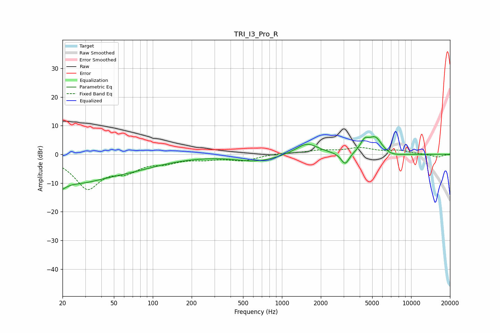

# TRI_I3_Pro_R
See [usage instructions](https://github.com/jaakkopasanen/AutoEq#usage) for more options and info.

### Parametric EQs
Apply preamp of -6.2 dB when using parametric equalizer.

|   # | Type    |   Fc (Hz) |    Q |   Gain (dB) |
|-----|---------|-----------|------|-------------|
|   1 | Peaking |        20 | 3.91 |        -8.6 |
|   2 | Peaking |        20 | 4.9  |         3.9 |
|   3 | Peaking |        26 | 0.8  |        -6.1 |
|   4 | Peaking |        56 | 0.47 |        -4.9 |
|   5 | Peaking |       641 | 0.87 |        -2.4 |
|   6 | Peaking |      1561 | 1.63 |         4.1 |
|   7 | Peaking |      3086 | 4.38 |        -4.3 |
|   8 | Peaking |      4355 | 4.53 |         3.3 |
|   9 | Peaking |      5297 | 2.34 |         6.5 |
|  10 | Peaking |      6555 | 1.45 |        -1.7 |

### Fixed Band EQs
When using fixed band (also called graphic) equalizer, apply preamp of **-2.5 dB** (if available) and set gains manually with these parameters.

|   # | Type    |   Fc (Hz) |    Q |   Gain (dB) |
|-----|---------|-----------|------|-------------|
|   1 | Peaking |        31 | 1.41 |       -11.4 |
|   2 | Peaking |        62 | 1.41 |        -4.4 |
|   3 | Peaking |       125 | 1.41 |        -2.1 |
|   4 | Peaking |       250 | 1.41 |        -1.3 |
|   5 | Peaking |       500 | 1.41 |        -2   |
|   6 | Peaking |      1000 | 1.41 |         0.5 |
|   7 | Peaking |      2000 | 1.41 |         1.2 |
|   8 | Peaking |      4000 | 1.41 |         2   |
|   9 | Peaking |      8000 | 1.41 |         1.2 |
|  10 | Peaking |     16000 | 1.41 |        -1   |

### Graphs

