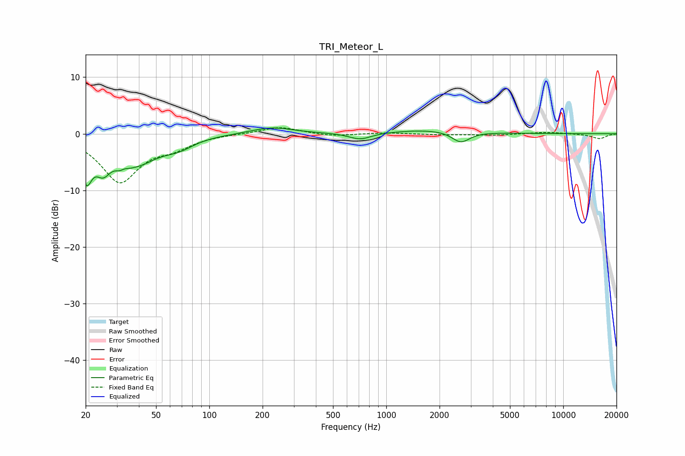

# TRI_Meteor_L
See [usage instructions](https://github.com/jaakkopasanen/AutoEq#usage) for more options and info.

### Parametric EQs
Apply preamp of -1.1 dB when using parametric equalizer.

|   # | Type    |   Fc (Hz) |    Q |   Gain (dB) |
|-----|---------|-----------|------|-------------|
|   1 | Peaking |        20 | 4.64 |        -6.4 |
|   2 | Peaking |        25 | 3.3  |        -3.9 |
|   3 | Peaking |        32 | 4.89 |        -4.2 |
|   4 | Peaking |        33 | 5.67 |         3.3 |
|   5 | Peaking |        39 | 1.15 |        -4.7 |
|   6 | Peaking |        67 | 1.71 |        -1.5 |
|   7 | Peaking |       226 | 1.22 |         1.2 |
|   8 | Peaking |       711 | 2.22 |        -1.2 |
|   9 | Peaking |      1838 | 0.65 |         0.7 |
|  10 | Peaking |      2638 | 2.82 |        -2   |

### Fixed Band EQs
When using fixed band (also called graphic) equalizer, apply preamp of **-1.1 dB** (if available) and set gains manually with these parameters.

|   # | Type    |   Fc (Hz) |    Q |   Gain (dB) |
|-----|---------|-----------|------|-------------|
|   1 | Peaking |        31 | 1.41 |        -8.3 |
|   2 | Peaking |        62 | 1.41 |        -1.9 |
|   3 | Peaking |       125 | 1.41 |         0   |
|   4 | Peaking |       250 | 1.41 |         1.3 |
|   5 | Peaking |       500 | 1.41 |        -0.5 |
|   6 | Peaking |      1000 | 1.41 |         0.2 |
|   7 | Peaking |      2000 | 1.41 |        -0.2 |
|   8 | Peaking |      4000 | 1.41 |        -0.3 |
|   9 | Peaking |      8000 | 1.41 |         0.3 |
|  10 | Peaking |     16000 | 1.41 |        -0.9 |

### Graphs

