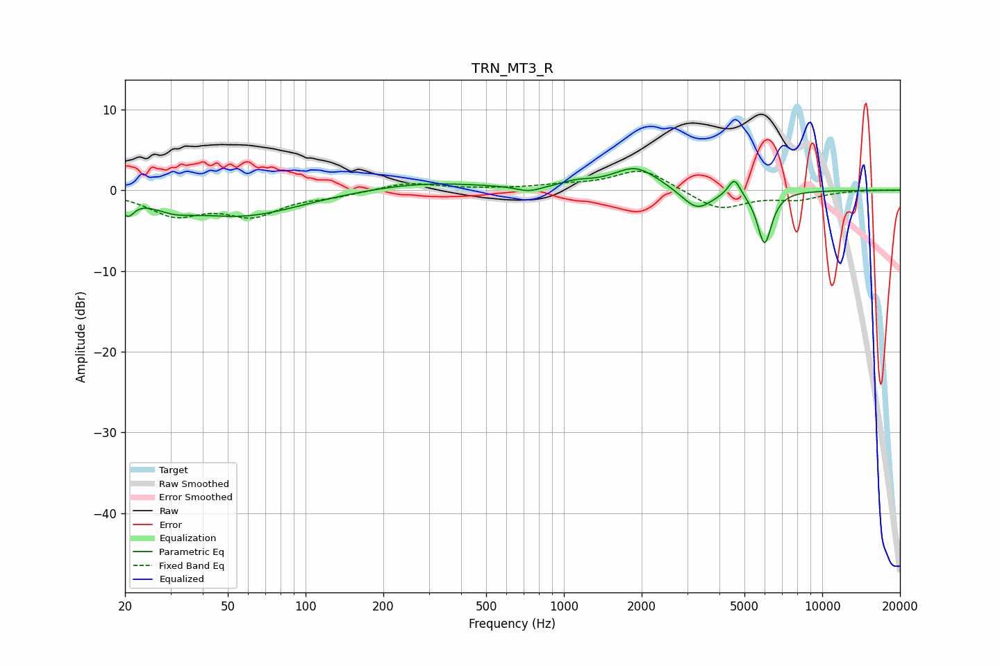

# TRN_MT3_R
See [usage instructions](https://github.com/jaakkopasanen/AutoEq#usage) for more options and info.

### Parametric EQs
Apply preamp of -2.8 dB when using parametric equalizer.

|   # | Type    |   Fc (Hz) |    Q |   Gain (dB) |
|-----|---------|-----------|------|-------------|
|   1 | Peaking |        20 | 5.93 |        -2   |
|   2 | Peaking |        31 | 1.99 |        -1   |
|   3 | Peaking |        56 | 0.62 |        -3.2 |
|   4 | Peaking |       286 | 0.61 |         1   |
|   5 | Peaking |       733 | 3.04 |        -0.7 |
|   6 | Peaking |      1117 | 2.26 |         0.7 |
|   7 | Peaking |      1899 | 1.59 |         2.8 |
|   8 | Peaking |      3274 | 2.38 |        -2.6 |
|   9 | Peaking |      4569 | 6    |         2.2 |
|  10 | Peaking |      5980 | 4.92 |        -6.6 |

### Fixed Band EQs
When using fixed band (also called graphic) equalizer, apply preamp of **-2.4 dB** (if available) and set gains manually with these parameters.

|   # | Type    |   Fc (Hz) |    Q |   Gain (dB) |
|-----|---------|-----------|------|-------------|
|   1 | Peaking |        31 | 1.41 |        -2.9 |
|   2 | Peaking |        62 | 1.41 |        -2.8 |
|   3 | Peaking |       125 | 1.41 |        -0.6 |
|   4 | Peaking |       250 | 1.41 |         1   |
|   5 | Peaking |       500 | 1.41 |         0.1 |
|   6 | Peaking |      1000 | 1.41 |         0.5 |
|   7 | Peaking |      2000 | 1.41 |         2.7 |
|   8 | Peaking |      4000 | 1.41 |        -2.4 |
|   9 | Peaking |      8000 | 1.41 |        -1   |
|  10 | Peaking |     16000 | 1.41 |         0   |

### Graphs

