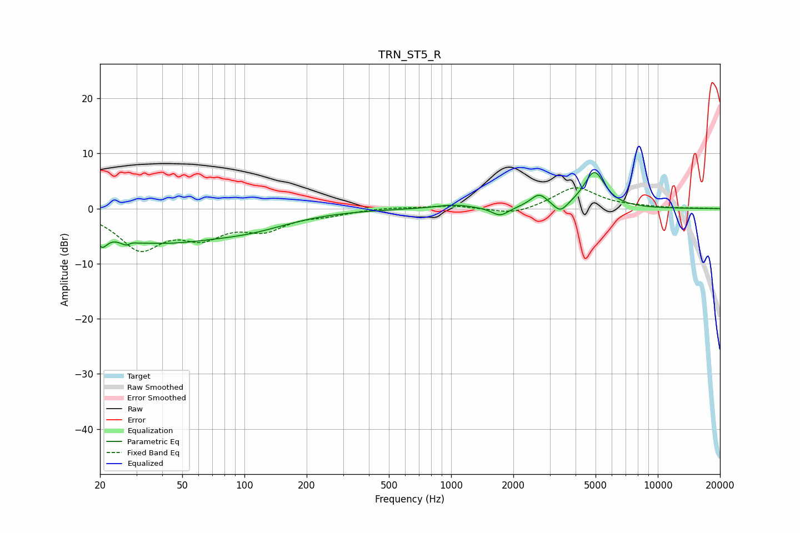

# TRN_ST5_R
See [usage instructions](https://github.com/jaakkopasanen/AutoEq#usage) for more options and info.

### Parametric EQs
Apply preamp of -6.6 dB when using parametric equalizer.

|   # | Type    |   Fc (Hz) |    Q |   Gain (dB) |
|-----|---------|-----------|------|-------------|
|   1 | Peaking |        20 | 5.51 |        -2.5 |
|   2 | Peaking |        28 | 5.14 |        -3.9 |
|   3 | Peaking |        28 | 5.77 |         3.2 |
|   4 | Peaking |        37 | 0.45 |        -5.7 |
|   5 | Peaking |       109 | 0.7  |        -2.1 |
|   6 | Peaking |      1032 | 1.61 |         0.7 |
|   7 | Peaking |      1727 | 3.48 |        -1.6 |
|   8 | Peaking |      2667 | 3.38 |         2.4 |
|   9 | Peaking |      3380 | 4.18 |        -1.9 |
|  10 | Peaking |      4933 | 2.71 |         6.6 |

### Fixed Band EQs
When using fixed band (also called graphic) equalizer, apply preamp of **-3.9 dB** (if available) and set gains manually with these parameters.

|   # | Type    |   Fc (Hz) |    Q |   Gain (dB) |
|-----|---------|-----------|------|-------------|
|   1 | Peaking |        31 | 1.41 |        -6.9 |
|   2 | Peaking |        62 | 1.41 |        -4.2 |
|   3 | Peaking |       125 | 1.41 |        -3.3 |
|   4 | Peaking |       250 | 1.41 |        -0.9 |
|   5 | Peaking |       500 | 1.41 |         0.2 |
|   6 | Peaking |      1000 | 1.41 |         0.5 |
|   7 | Peaking |      2000 | 1.41 |        -1.2 |
|   8 | Peaking |      4000 | 1.41 |         3.9 |
|   9 | Peaking |      8000 | 1.41 |         0.2 |
|  10 | Peaking |     16000 | 1.41 |         0.1 |

### Graphs

