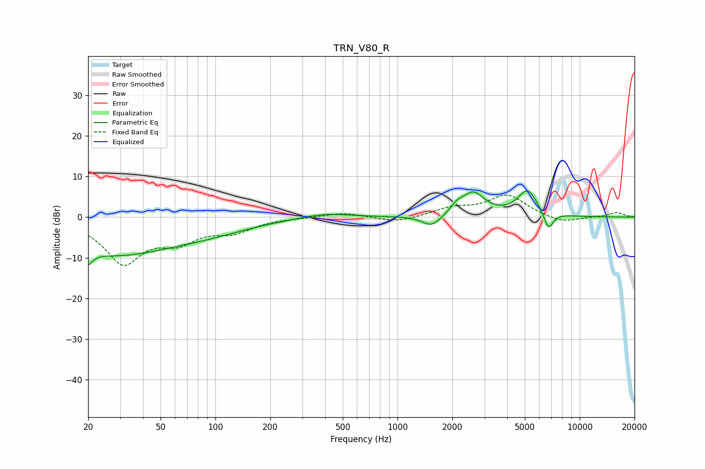

# TRN_V80_R
See [usage instructions](https://github.com/jaakkopasanen/AutoEq#usage) for more options and info.

### Parametric EQs
Apply preamp of -6.5 dB when using parametric equalizer.

|   # | Type    |   Fc (Hz) |    Q |   Gain (dB) |
|-----|---------|-----------|------|-------------|
|   1 | Peaking |        20 | 5.8  |        -9.3 |
|   2 | Peaking |        20 | 5.92 |         5.7 |
|   3 | Peaking |        28 | 0.44 |        -8.7 |
|   4 | Peaking |        93 | 0.6  |        -2.2 |
|   5 | Peaking |       402 | 1.05 |         1.2 |
|   6 | Peaking |      1541 | 2.71 |        -2.8 |
|   7 | Peaking |      2113 | 4.28 |         1.6 |
|   8 | Peaking |      2600 | 2.23 |         5.7 |
|   9 | Peaking |      5181 | 2.51 |         6.4 |
|  10 | Peaking |      6741 | 5.2  |        -4.5 |

### Fixed Band EQs
When using fixed band (also called graphic) equalizer, apply preamp of **-5.5 dB** (if available) and set gains manually with these parameters.

|   # | Type    |   Fc (Hz) |    Q |   Gain (dB) |
|-----|---------|-----------|------|-------------|
|   1 | Peaking |        31 | 1.41 |       -10.9 |
|   2 | Peaking |        62 | 1.41 |        -4.7 |
|   3 | Peaking |       125 | 1.41 |        -3.1 |
|   4 | Peaking |       250 | 1.41 |        -0.1 |
|   5 | Peaking |       500 | 1.41 |         1.1 |
|   6 | Peaking |      1000 | 1.41 |        -1.4 |
|   7 | Peaking |      2000 | 1.41 |         2   |
|   8 | Peaking |      4000 | 1.41 |         5.3 |
|   9 | Peaking |      8000 | 1.41 |        -1.6 |
|  10 | Peaking |     16000 | 1.41 |         1.1 |

### Graphs

