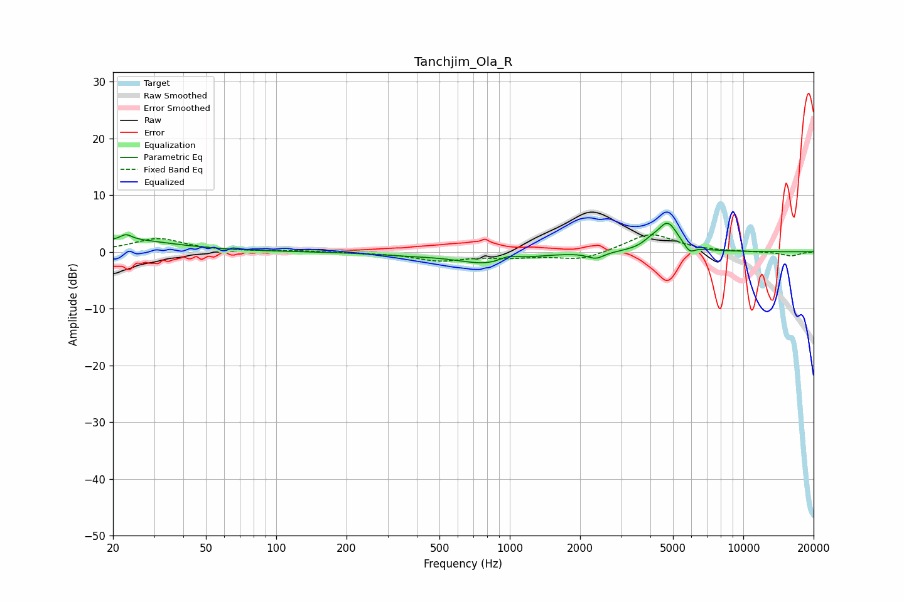

# Tanchjim_Ola_R
See [usage instructions](https://github.com/jaakkopasanen/AutoEq#usage) for more options and info.

### Parametric EQs
Apply preamp of -5.1 dB when using parametric equalizer.

|   # | Type    |   Fc (Hz) |    Q |   Gain (dB) |
|-----|---------|-----------|------|-------------|
|   1 | Peaking |        23 | 5.92 |         2.7 |
|   2 | Peaking |        23 | 5.96 |        -1.7 |
|   3 | Peaking |        23 | 0.72 |         2   |
|   4 | Peaking |       374 | 0.85 |        -0.4 |
|   5 | Peaking |       823 | 1.12 |        -2.1 |
|   6 | Peaking |       985 | 3.23 |         1   |
|   7 | Peaking |      2337 | 4.03 |        -1.1 |
|   8 | Peaking |      3995 | 4.4  |         0.7 |
|   9 | Peaking |      4741 | 3.07 |         5   |
|  10 | Peaking |      5886 | 6    |        -1.4 |

### Fixed Band EQs
When using fixed band (also called graphic) equalizer, apply preamp of **-3.1 dB** (if available) and set gains manually with these parameters.

|   # | Type    |   Fc (Hz) |    Q |   Gain (dB) |
|-----|---------|-----------|------|-------------|
|   1 | Peaking |        31 | 1.41 |         2.3 |
|   2 | Peaking |        62 | 1.41 |         0   |
|   3 | Peaking |       125 | 1.41 |         0.2 |
|   4 | Peaking |       250 | 1.41 |        -0.1 |
|   5 | Peaking |       500 | 1.41 |        -1.5 |
|   6 | Peaking |      1000 | 1.41 |        -0.8 |
|   7 | Peaking |      2000 | 1.41 |        -1.5 |
|   8 | Peaking |      4000 | 1.41 |         3.3 |
|   9 | Peaking |      8000 | 1.41 |         0   |
|  10 | Peaking |     16000 | 1.41 |        -0.7 |

### Graphs

