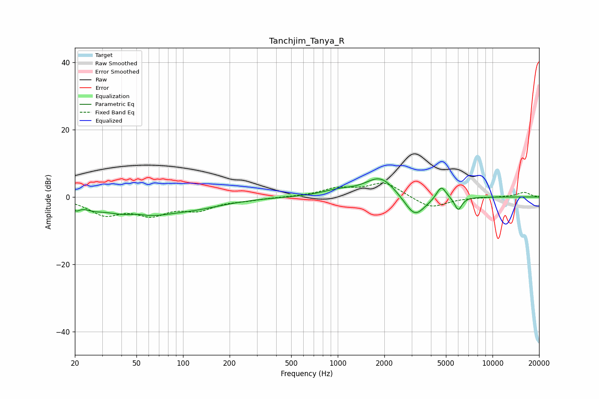

# Tanchjim_Tanya_R
See [usage instructions](https://github.com/jaakkopasanen/AutoEq#usage) for more options and info.

### Parametric EQs
Apply preamp of -5.5 dB when using parametric equalizer.

|   # | Type    |   Fc (Hz) |    Q |   Gain (dB) |
|-----|---------|-----------|------|-------------|
|   1 | Peaking |        20 | 5.99 |        -1.8 |
|   2 | Peaking |        26 | 2.47 |        -1.1 |
|   3 | Peaking |        49 | 0.71 |        -5.6 |
|   4 | Peaking |        50 | 2.14 |         1.3 |
|   5 | Peaking |       121 | 0.68 |        -2.2 |
|   6 | Peaking |       999 | 1.34 |         1.5 |
|   7 | Peaking |      1891 | 1.42 |         6.2 |
|   8 | Peaking |      3148 | 2.03 |        -6.8 |
|   9 | Peaking |      4669 | 4.46 |         4.1 |
|  10 | Peaking |      6003 | 5.77 |        -3.9 |

### Fixed Band EQs
When using fixed band (also called graphic) equalizer, apply preamp of **-4.2 dB** (if available) and set gains manually with these parameters.

|   # | Type    |   Fc (Hz) |    Q |   Gain (dB) |
|-----|---------|-----------|------|-------------|
|   1 | Peaking |        31 | 1.41 |        -4.8 |
|   2 | Peaking |        62 | 1.41 |        -4.5 |
|   3 | Peaking |       125 | 1.41 |        -3.3 |
|   4 | Peaking |       250 | 1.41 |        -0.7 |
|   5 | Peaking |       500 | 1.41 |        -0   |
|   6 | Peaking |      1000 | 1.41 |         2.3 |
|   7 | Peaking |      2000 | 1.41 |         4.2 |
|   8 | Peaking |      4000 | 1.41 |        -3.5 |
|   9 | Peaking |      8000 | 1.41 |        -0.1 |
|  10 | Peaking |     16000 | 1.41 |         1.4 |

### Graphs

