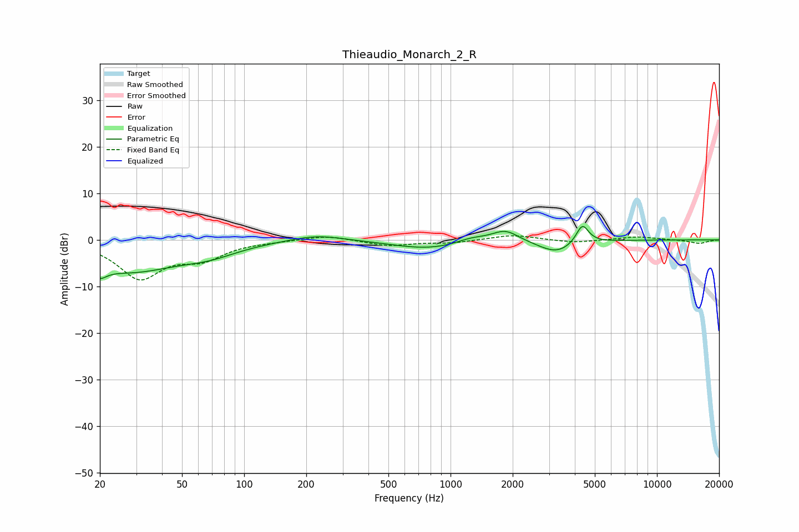

# Thieaudio_Monarch_2_R
See [usage instructions](https://github.com/jaakkopasanen/AutoEq#usage) for more options and info.

### Parametric EQs
Apply preamp of -3.0 dB when using parametric equalizer.

|   # | Type    |   Fc (Hz) |    Q |   Gain (dB) |
|-----|---------|-----------|------|-------------|
|   1 | Peaking |        20 | 4.8  |        -6   |
|   2 | Peaking |        20 | 5.25 |         3.6 |
|   3 | Peaking |        28 | 0.56 |        -6.6 |
|   4 | Peaking |        68 | 1.07 |        -1.7 |
|   5 | Peaking |       225 | 1.09 |         1.4 |
|   6 | Peaking |       795 | 0.79 |        -2   |
|   7 | Peaking |      1260 | 1.8  |         1.2 |
|   8 | Peaking |      1841 | 2.18 |         2.5 |
|   9 | Peaking |      3261 | 1.62 |        -2.8 |
|  10 | Peaking |      4352 | 4.59 |         4.2 |

### Fixed Band EQs
When using fixed band (also called graphic) equalizer, apply preamp of **-1.0 dB** (if available) and set gains manually with these parameters.

|   # | Type    |   Fc (Hz) |    Q |   Gain (dB) |
|-----|---------|-----------|------|-------------|
|   1 | Peaking |        31 | 1.41 |        -8   |
|   2 | Peaking |        62 | 1.41 |        -3.5 |
|   3 | Peaking |       125 | 1.41 |        -0.2 |
|   4 | Peaking |       250 | 1.41 |         1   |
|   5 | Peaking |       500 | 1.41 |        -1.2 |
|   6 | Peaking |      1000 | 1.41 |        -0.6 |
|   7 | Peaking |      2000 | 1.41 |         1.1 |
|   8 | Peaking |      4000 | 1.41 |        -0.6 |
|   9 | Peaking |      8000 | 1.41 |         0.7 |
|  10 | Peaking |     16000 | 1.41 |        -0.8 |

### Graphs

