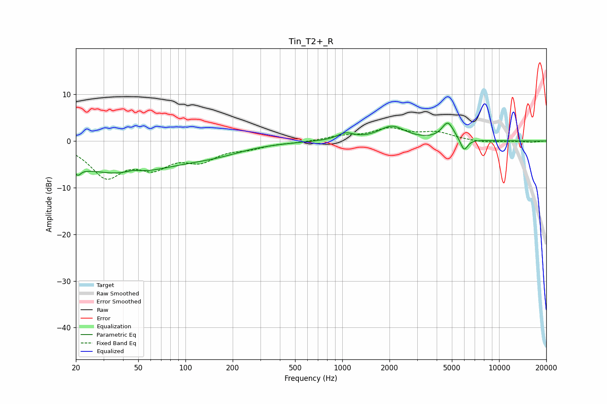

# Tin_T2+_R
See [usage instructions](https://github.com/jaakkopasanen/AutoEq#usage) for more options and info.

### Parametric EQs
Apply preamp of -3.9 dB when using parametric equalizer.

|   # | Type    |   Fc (Hz) |    Q |   Gain (dB) |
|-----|---------|-----------|------|-------------|
|   1 | Peaking |        21 | 4.88 |        -5.4 |
|   2 | Peaking |        21 | 5.37 |         3.5 |
|   3 | Peaking |        39 | 0.4  |        -6.9 |
|   4 | Peaking |        47 | 2.92 |         0.7 |
|   5 | Peaking |       153 | 1.42 |         0.1 |
|   6 | Peaking |       155 | 0.79 |        -1.6 |
|   7 | Peaking |      1047 | 2.71 |         1.4 |
|   8 | Peaking |      2075 | 1.71 |         3.1 |
|   9 | Peaking |      4714 | 3.59 |         3.8 |
|  10 | Peaking |      5980 | 5.81 |        -2.7 |

### Fixed Band EQs
When using fixed band (also called graphic) equalizer, apply preamp of **-3.0 dB** (if available) and set gains manually with these parameters.

|   # | Type    |   Fc (Hz) |    Q |   Gain (dB) |
|-----|---------|-----------|------|-------------|
|   1 | Peaking |        31 | 1.41 |        -7.2 |
|   2 | Peaking |        62 | 1.41 |        -4.6 |
|   3 | Peaking |       125 | 1.41 |        -3.6 |
|   4 | Peaking |       250 | 1.41 |        -1.2 |
|   5 | Peaking |       500 | 1.41 |        -0.3 |
|   6 | Peaking |      1000 | 1.41 |         0.9 |
|   7 | Peaking |      2000 | 1.41 |         2.4 |
|   8 | Peaking |      4000 | 1.41 |         1.6 |
|   9 | Peaking |      8000 | 1.41 |        -0.4 |
|  10 | Peaking |     16000 | 1.41 |        -0.3 |

### Graphs

