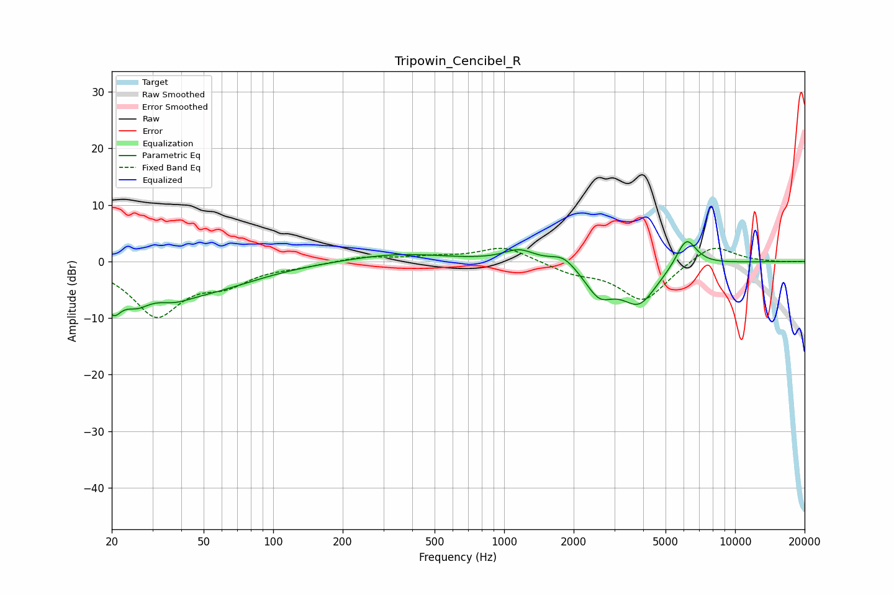

# Tripowin_Cencibel_R
See [usage instructions](https://github.com/jaakkopasanen/AutoEq#usage) for more options and info.

### Parametric EQs
Apply preamp of -3.6 dB when using parametric equalizer.

|   # | Type    |   Fc (Hz) |    Q |   Gain (dB) |
|-----|---------|-----------|------|-------------|
|   1 | Peaking |        20 | 3.76 |        -5.7 |
|   2 | Peaking |        26 | 2.29 |        -3.7 |
|   3 | Peaking |        37 | 1.82 |        -2   |
|   4 | Peaking |        50 | 0.62 |        -4.8 |
|   5 | Peaking |       348 | 0.67 |         1.4 |
|   6 | Peaking |      1164 | 2.09 |         2.1 |
|   7 | Peaking |      1807 | 2.62 |         1.9 |
|   8 | Peaking |      2582 | 2.27 |        -4.9 |
|   9 | Peaking |      3835 | 1.71 |        -7.1 |
|  10 | Peaking |      6149 | 3.08 |         5.3 |

### Fixed Band EQs
When using fixed band (also called graphic) equalizer, apply preamp of **-2.4 dB** (if available) and set gains manually with these parameters.

|   # | Type    |   Fc (Hz) |    Q |   Gain (dB) |
|-----|---------|-----------|------|-------------|
|   1 | Peaking |        31 | 1.41 |        -9.3 |
|   2 | Peaking |        62 | 1.41 |        -3.2 |
|   3 | Peaking |       125 | 1.41 |        -0.6 |
|   4 | Peaking |       250 | 1.41 |         0.9 |
|   5 | Peaking |       500 | 1.41 |         0.7 |
|   6 | Peaking |      1000 | 1.41 |         2.7 |
|   7 | Peaking |      2000 | 1.41 |        -1.7 |
|   8 | Peaking |      4000 | 1.41 |        -7   |
|   9 | Peaking |      8000 | 1.41 |         3.3 |
|  10 | Peaking |     16000 | 1.41 |        -0.1 |

### Graphs

