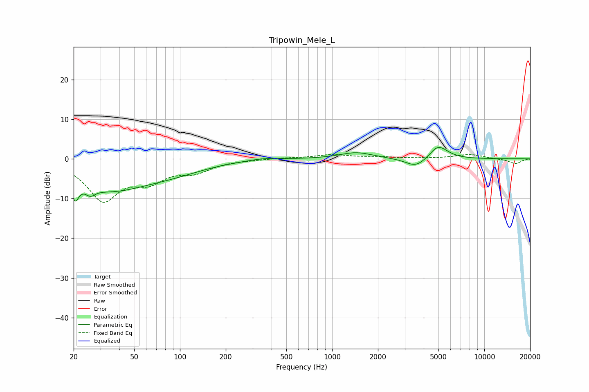

# Tripowin_Mele_L
See [usage instructions](https://github.com/jaakkopasanen/AutoEq#usage) for more options and info.

### Parametric EQs
Apply preamp of -3.0 dB when using parametric equalizer.

|   # | Type    |   Fc (Hz) |    Q |   Gain (dB) |
|-----|---------|-----------|------|-------------|
|   1 | Peaking |        20 | 5.66 |         3.4 |
|   2 | Peaking |        20 | 5.9  |        -8   |
|   3 | Peaking |        26 | 4.57 |        -1.8 |
|   4 | Peaking |        34 | 0.54 |        -7.3 |
|   5 | Peaking |        91 | 0.65 |        -2.1 |
|   6 | Peaking |       353 | 1.47 |         0.5 |
|   7 | Peaking |      1441 | 1.31 |         1.6 |
|   8 | Peaking |      3556 | 2.07 |        -2.3 |
|   9 | Peaking |      4787 | 3.53 |         0.8 |
|  10 | Peaking |      5093 | 2.23 |         2.8 |

### Fixed Band EQs
When using fixed band (also called graphic) equalizer, apply preamp of **-1.2 dB** (if available) and set gains manually with these parameters.

|   # | Type    |   Fc (Hz) |    Q |   Gain (dB) |
|-----|---------|-----------|------|-------------|
|   1 | Peaking |        31 | 1.41 |       -10   |
|   2 | Peaking |        62 | 1.41 |        -4.5 |
|   3 | Peaking |       125 | 1.41 |        -2.8 |
|   4 | Peaking |       250 | 1.41 |        -0.2 |
|   5 | Peaking |       500 | 1.41 |         0.2 |
|   6 | Peaking |      1000 | 1.41 |         1   |
|   7 | Peaking |      2000 | 1.41 |         0.4 |
|   8 | Peaking |      4000 | 1.41 |         0.1 |
|   9 | Peaking |      8000 | 1.41 |         1.1 |
|  10 | Peaking |     16000 | 1.41 |        -1.2 |

### Graphs

