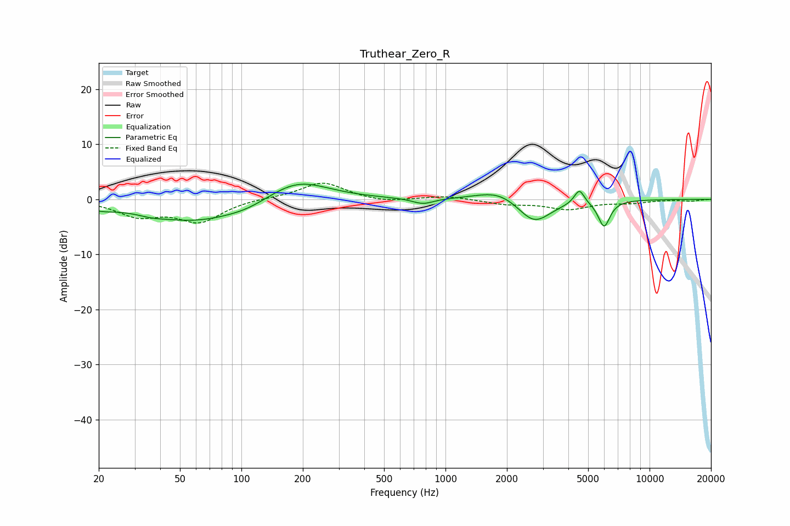

# Truthear_Zero_R
See [usage instructions](https://github.com/jaakkopasanen/AutoEq#usage) for more options and info.

### Parametric EQs
Apply preamp of -2.8 dB when using parametric equalizer.

|   # | Type    |   Fc (Hz) |    Q |   Gain (dB) |
|-----|---------|-----------|------|-------------|
|   1 | Peaking |        20 | 1.96 |        -0.8 |
|   2 | Peaking |        36 | 2.63 |        -0.4 |
|   3 | Peaking |        60 | 0.54 |        -4.1 |
|   4 | Peaking |       108 | 1.44 |        -0.7 |
|   5 | Peaking |       187 | 0.92 |         4.1 |
|   6 | Peaking |       776 | 2.69 |        -1.1 |
|   7 | Peaking |      1838 | 1.31 |         2.1 |
|   8 | Peaking |      2716 | 1.72 |        -4.6 |
|   9 | Peaking |      4526 | 5.63 |         2.7 |
|  10 | Peaking |      5986 | 4.79 |        -4.8 |

### Fixed Band EQs
When using fixed band (also called graphic) equalizer, apply preamp of **-3.0 dB** (if available) and set gains manually with these parameters.

|   # | Type    |   Fc (Hz) |    Q |   Gain (dB) |
|-----|---------|-----------|------|-------------|
|   1 | Peaking |        31 | 1.41 |        -2.8 |
|   2 | Peaking |        62 | 1.41 |        -3.9 |
|   3 | Peaking |       125 | 1.41 |         0.2 |
|   4 | Peaking |       250 | 1.41 |         3.1 |
|   5 | Peaking |       500 | 1.41 |        -0.6 |
|   6 | Peaking |      1000 | 1.41 |         0.6 |
|   7 | Peaking |      2000 | 1.41 |        -0.8 |
|   8 | Peaking |      4000 | 1.41 |        -1.7 |
|   9 | Peaking |      8000 | 1.41 |        -0.6 |
|  10 | Peaking |     16000 | 1.41 |        -0.3 |

### Graphs

