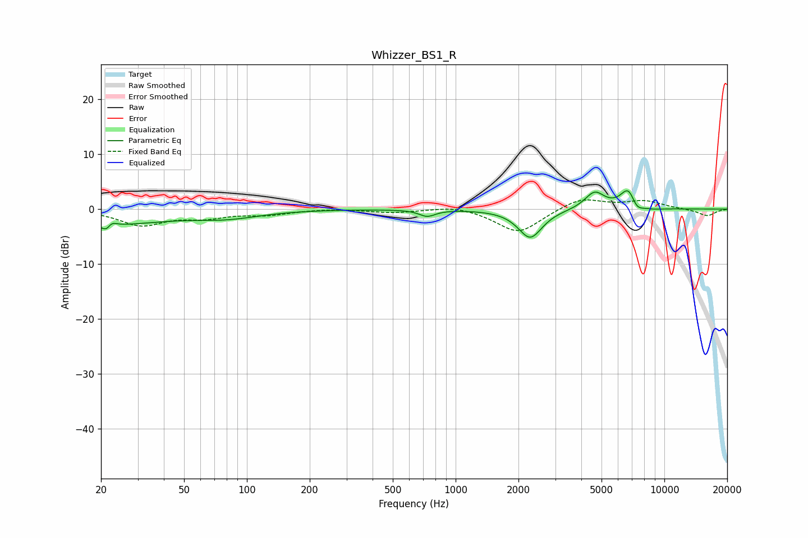

# Whizzer_BS1_R
See [usage instructions](https://github.com/jaakkopasanen/AutoEq#usage) for more options and info.

### Parametric EQs
Apply preamp of -3.5 dB when using parametric equalizer.

|   # | Type    |   Fc (Hz) |    Q |   Gain (dB) |
|-----|---------|-----------|------|-------------|
|   1 | Peaking |        20 | 0.49 |        -2.8 |
|   2 | Peaking |        22 | 5.89 |        -2.6 |
|   3 | Peaking |        22 | 5.99 |         2.3 |
|   4 | Peaking |        80 | 0.89 |        -1.3 |
|   5 | Peaking |       731 | 3.71 |        -1.2 |
|   6 | Peaking |      2277 | 2.46 |        -5.3 |
|   7 | Peaking |      4636 | 2.95 |         3.1 |
|   8 | Peaking |      6770 | 3.54 |         4.5 |
|   9 | Peaking |      7294 | 4.02 |        -2.3 |
|  10 | Peaking |      8908 | 2.8  |        -0.3 |

### Fixed Band EQs
When using fixed band (also called graphic) equalizer, apply preamp of **-1.8 dB** (if available) and set gains manually with these parameters.

|   # | Type    |   Fc (Hz) |    Q |   Gain (dB) |
|-----|---------|-----------|------|-------------|
|   1 | Peaking |        31 | 1.41 |        -2.8 |
|   2 | Peaking |        62 | 1.41 |        -1.3 |
|   3 | Peaking |       125 | 1.41 |        -0.9 |
|   4 | Peaking |       250 | 1.41 |         0.2 |
|   5 | Peaking |       500 | 1.41 |        -0.6 |
|   6 | Peaking |      1000 | 1.41 |         0.7 |
|   7 | Peaking |      2000 | 1.41 |        -4.4 |
|   8 | Peaking |      4000 | 1.41 |         2.1 |
|   9 | Peaking |      8000 | 1.41 |         1.4 |
|  10 | Peaking |     16000 | 1.41 |        -1.3 |

### Graphs

