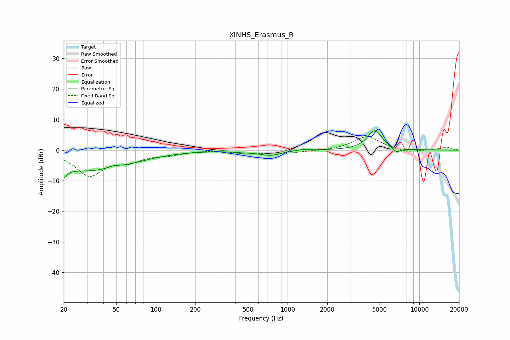

# XINHS_Erasmus_R
See [usage instructions](https://github.com/jaakkopasanen/AutoEq#usage) for more options and info.

### Parametric EQs
Apply preamp of -6.5 dB when using parametric equalizer.

|   # | Type    |   Fc (Hz) |    Q |   Gain (dB) |
|-----|---------|-----------|------|-------------|
|   1 | Peaking |        20 | 5.61 |        -6.7 |
|   2 | Peaking |        20 | 5.87 |         3.3 |
|   3 | Peaking |        29 | 0.47 |        -6.1 |
|   4 | Peaking |        47 | 3    |         0.8 |
|   5 | Peaking |        55 | 0.65 |        -1.1 |
|   6 | Peaking |       481 | 1.65 |        -0.4 |
|   7 | Peaking |       744 | 1.85 |        -1.6 |
|   8 | Peaking |      1298 | 3.14 |         0.4 |
|   9 | Peaking |      4598 | 2.5  |         6.5 |
|  10 | Peaking |      6676 | 4.33 |        -1.6 |

### Fixed Band EQs
When using fixed band (also called graphic) equalizer, apply preamp of **-4.5 dB** (if available) and set gains manually with these parameters.

|   # | Type    |   Fc (Hz) |    Q |   Gain (dB) |
|-----|---------|-----------|------|-------------|
|   1 | Peaking |        31 | 1.41 |        -8   |
|   2 | Peaking |        62 | 1.41 |        -2.9 |
|   3 | Peaking |       125 | 1.41 |        -1.2 |
|   4 | Peaking |       250 | 1.41 |         0.2 |
|   5 | Peaking |       500 | 1.41 |        -1.1 |
|   6 | Peaking |      1000 | 1.41 |        -0.9 |
|   7 | Peaking |      2000 | 1.41 |        -0.2 |
|   8 | Peaking |      4000 | 1.41 |         4.6 |
|   9 | Peaking |      8000 | 1.41 |        -1   |
|  10 | Peaking |     16000 | 1.41 |         1   |

### Graphs

