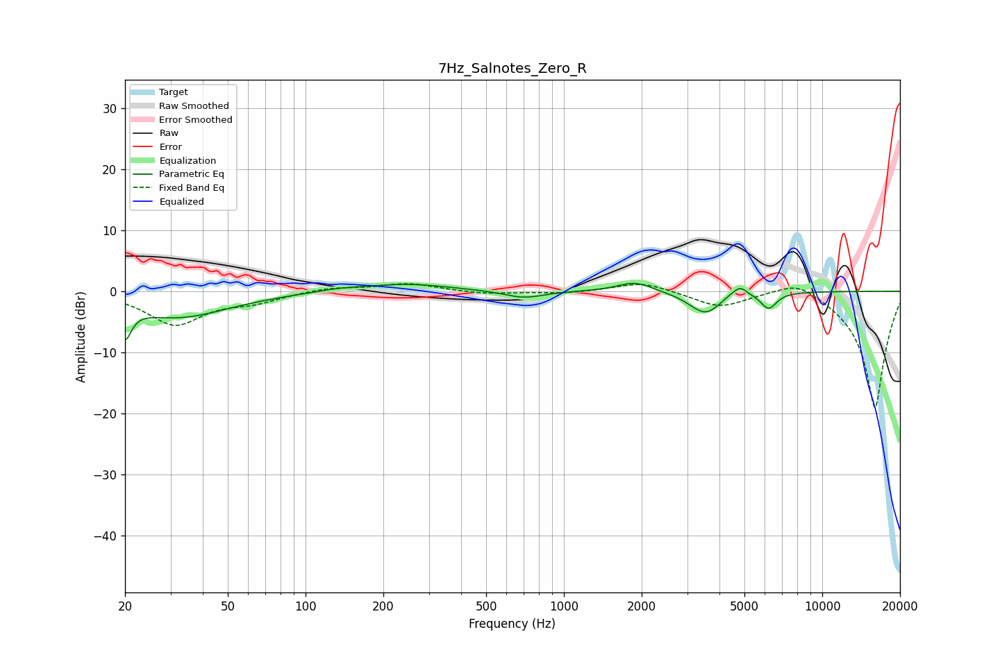

# 7Hz_Salnotes_Zero_R
See [usage instructions](https://github.com/jaakkopasanen/AutoEq#usage) for more options and info.

### Parametric EQs
Apply preamp of -1.4 dB when using parametric equalizer.

|   # | Type    |   Fc (Hz) |    Q |   Gain (dB) |
|-----|---------|-----------|------|-------------|
|   1 | Peaking |        20 | 5.92 |        -5.1 |
|   2 | Peaking |        32 | 0.71 |        -4.2 |
|   3 | Peaking |       135 | 1.53 |         0.4 |
|   4 | Peaking |       247 | 0.86 |         1.2 |
|   5 | Peaking |       699 | 1.86 |        -1.2 |
|   6 | Peaking |      1883 | 2.08 |         1.7 |
|   7 | Peaking |      3538 | 2.22 |        -3.8 |
|   8 | Peaking |      4554 | 2.96 |         1   |
|   9 | Peaking |      4827 | 6    |         1   |
|  10 | Peaking |      6201 | 4.5  |        -2.7 |

### Fixed Band EQs
When using fixed band (also called graphic) equalizer, apply preamp of **-1.3 dB** (if available) and set gains manually with these parameters.

|   # | Type    |   Fc (Hz) |    Q |   Gain (dB) |
|-----|---------|-----------|------|-------------|
|   1 | Peaking |        31 | 1.41 |        -5.3 |
|   2 | Peaking |        62 | 1.41 |        -1.5 |
|   3 | Peaking |       125 | 1.41 |         0.7 |
|   4 | Peaking |       250 | 1.41 |         1.3 |
|   5 | Peaking |       500 | 1.41 |        -0.5 |
|   6 | Peaking |      1000 | 1.41 |        -0.4 |
|   7 | Peaking |      2000 | 1.41 |         1.6 |
|   8 | Peaking |      4000 | 1.41 |        -2.6 |
|   9 | Peaking |      8000 | 1.41 |         2.5 |
|  10 | Peaking |     16000 | 1.41 |       -19.3 |

### Graphs

