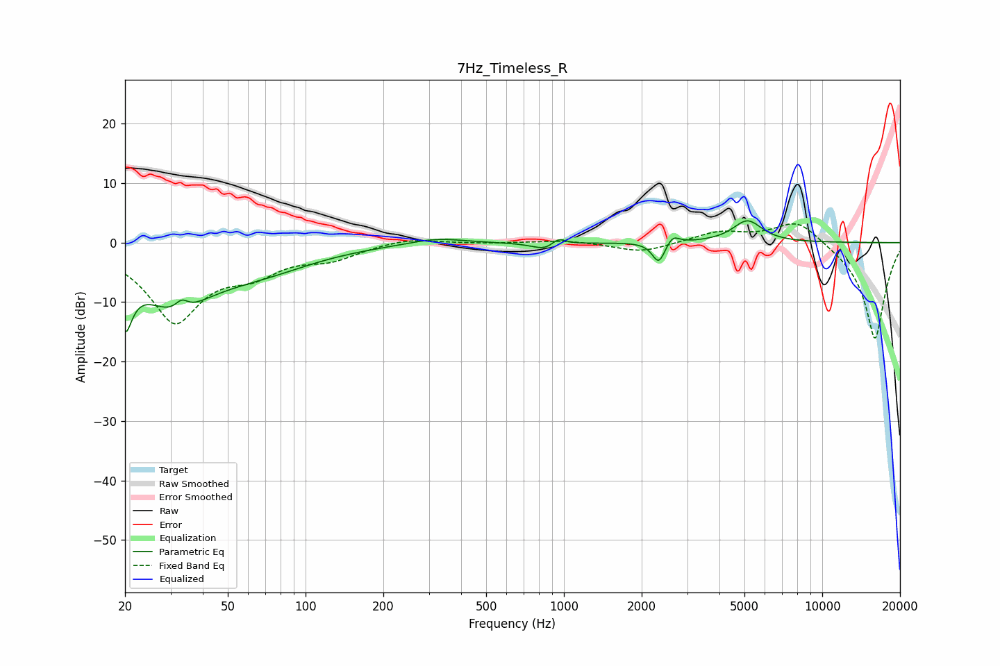

# 7Hz_Timeless_R
See [usage instructions](https://github.com/jaakkopasanen/AutoEq#usage) for more options and info.

### Parametric EQs
Apply preamp of -3.8 dB when using parametric equalizer.

|   # | Type    |   Fc (Hz) |    Q |   Gain (dB) |
|-----|---------|-----------|------|-------------|
|   1 | Peaking |        20 | 5.04 |        -9   |
|   2 | Peaking |        31 | 0.97 |        -9.4 |
|   3 | Peaking |        33 | 5.91 |         1.7 |
|   4 | Peaking |        67 | 0.66 |        -3.6 |
|   5 | Peaking |       321 | 1.35 |         1   |
|   6 | Peaking |       869 | 2.78 |        -1.6 |
|   7 | Peaking |       948 | 4.55 |         1.7 |
|   8 | Peaking |      2329 | 5.79 |        -3.6 |
|   9 | Peaking |      2636 | 6    |         1.5 |
|  10 | Peaking |      5133 | 2.47 |         3.7 |

### Fixed Band EQs
When using fixed band (also called graphic) equalizer, apply preamp of **-3.2 dB** (if available) and set gains manually with these parameters.

|   # | Type    |   Fc (Hz) |    Q |   Gain (dB) |
|-----|---------|-----------|------|-------------|
|   1 | Peaking |        31 | 1.41 |       -12.9 |
|   2 | Peaking |        62 | 1.41 |        -3.7 |
|   3 | Peaking |       125 | 1.41 |        -2.3 |
|   4 | Peaking |       250 | 1.41 |         0.9 |
|   5 | Peaking |       500 | 1.41 |        -0.1 |
|   6 | Peaking |      1000 | 1.41 |         0.4 |
|   7 | Peaking |      2000 | 1.41 |        -1.7 |
|   8 | Peaking |      4000 | 1.41 |         1.8 |
|   9 | Peaking |      8000 | 1.41 |         4.1 |
|  10 | Peaking |     16000 | 1.41 |       -16.4 |

### Graphs

