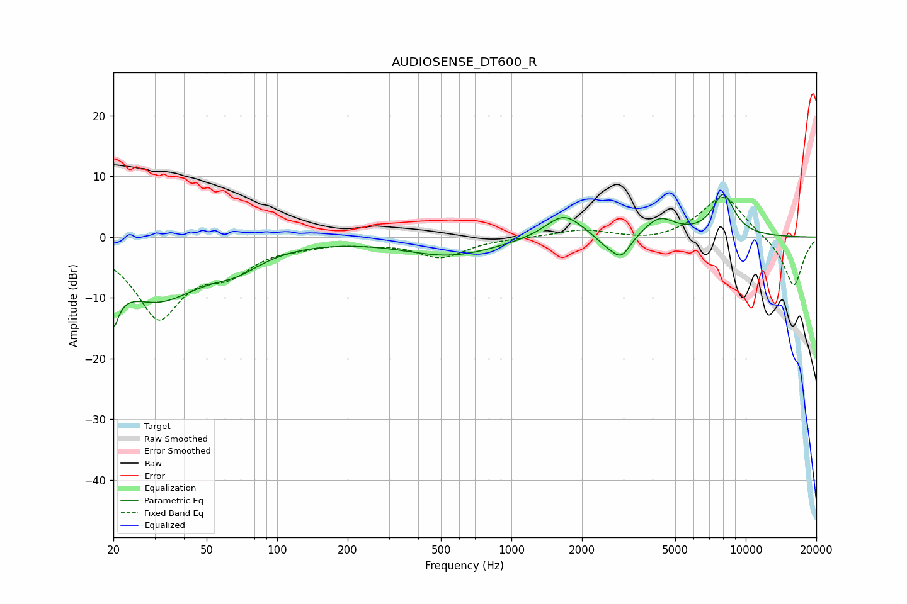

# AUDIOSENSE_DT600_R
See [usage instructions](https://github.com/jaakkopasanen/AutoEq#usage) for more options and info.

### Parametric EQs
Apply preamp of -7.1 dB when using parametric equalizer.

|   # | Type    |   Fc (Hz) |    Q |   Gain (dB) |
|-----|---------|-----------|------|-------------|
|   1 | Peaking |        20 | 5.56 |       -10.8 |
|   2 | Peaking |        20 | 5.94 |         3.3 |
|   3 | Peaking |        31 | 0.68 |       -10   |
|   4 | Peaking |        67 | 1.43 |        -2.2 |
|   5 | Peaking |       549 | 0.71 |        -3   |
|   6 | Peaking |      1671 | 1.79 |         4.1 |
|   7 | Peaking |      2531 | 2.81 |        -1.4 |
|   8 | Peaking |      2943 | 3.43 |        -3.6 |
|   9 | Peaking |      4285 | 2.17 |         3   |
|  10 | Peaking |      8028 | 2.75 |         6.8 |

### Fixed Band EQs
When using fixed band (also called graphic) equalizer, apply preamp of **-6.6 dB** (if available) and set gains manually with these parameters.

|   # | Type    |   Fc (Hz) |    Q |   Gain (dB) |
|-----|---------|-----------|------|-------------|
|   1 | Peaking |        31 | 1.41 |       -12.8 |
|   2 | Peaking |        62 | 1.41 |        -4.3 |
|   3 | Peaking |       125 | 1.41 |        -0.8 |
|   4 | Peaking |       250 | 1.41 |        -0.6 |
|   5 | Peaking |       500 | 1.41 |        -3.2 |
|   6 | Peaking |      1000 | 1.41 |        -0   |
|   7 | Peaking |      2000 | 1.41 |         1.2 |
|   8 | Peaking |      4000 | 1.41 |        -0.8 |
|   9 | Peaking |      8000 | 1.41 |         7.1 |
|  10 | Peaking |     16000 | 1.41 |        -8.3 |

### Graphs

