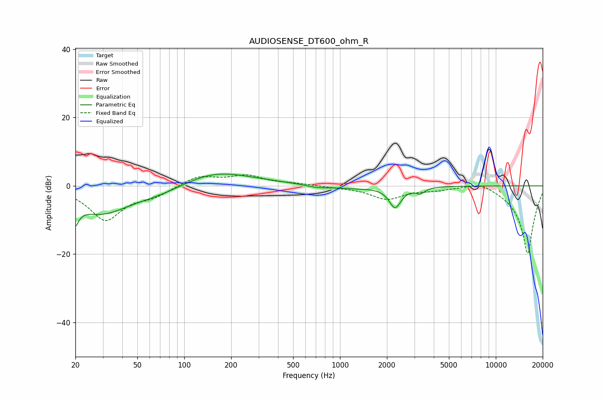

# AUDIOSENSE_DT600_ohm_R
See [usage instructions](https://github.com/jaakkopasanen/AutoEq#usage) for more options and info.

### Parametric EQs
Apply preamp of -3.5 dB when using parametric equalizer.

|   # | Type    |   Fc (Hz) |    Q |   Gain (dB) |
|-----|---------|-----------|------|-------------|
|   1 | Peaking |        20 | 5.59 |        -9.5 |
|   2 | Peaking |        20 | 5.84 |         3.3 |
|   3 | Peaking |        29 | 0.77 |        -7.7 |
|   4 | Peaking |        71 | 0.79 |        -2.1 |
|   5 | Peaking |       153 | 0.67 |         3.6 |
|   6 | Peaking |       208 | 0.45 |         1   |
|   7 | Peaking |       711 | 1.99 |        -0.8 |
|   8 | Peaking |      1220 | 1.09 |        -0.7 |
|   9 | Peaking |      2257 | 3.66 |        -6.1 |
|  10 | Peaking |      3277 | 4.98 |        -1.6 |

### Fixed Band EQs
When using fixed band (also called graphic) equalizer, apply preamp of **-3.3 dB** (if available) and set gains manually with these parameters.

|   # | Type    |   Fc (Hz) |    Q |   Gain (dB) |
|-----|---------|-----------|------|-------------|
|   1 | Peaking |        31 | 1.41 |        -9.8 |
|   2 | Peaking |        62 | 1.41 |        -2.4 |
|   3 | Peaking |       125 | 1.41 |         2.9 |
|   4 | Peaking |       250 | 1.41 |         2.8 |
|   5 | Peaking |       500 | 1.41 |         0.6 |
|   6 | Peaking |      1000 | 1.41 |        -0.3 |
|   7 | Peaking |      2000 | 1.41 |        -3.7 |
|   8 | Peaking |      4000 | 1.41 |        -0.9 |
|   9 | Peaking |      8000 | 1.41 |         1.8 |
|  10 | Peaking |     16000 | 1.41 |       -20   |

### Graphs

