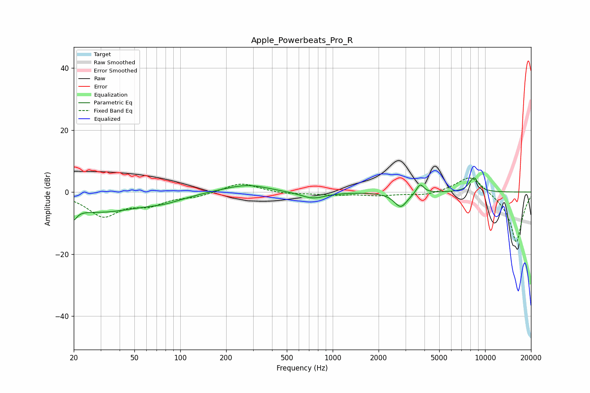

# Apple_Powerbeats_Pro_R
See [usage instructions](https://github.com/jaakkopasanen/AutoEq#usage) for more options and info.

### Parametric EQs
Apply preamp of -4.7 dB when using parametric equalizer.

|   # | Type    |   Fc (Hz) |    Q |   Gain (dB) |
|-----|---------|-----------|------|-------------|
|   1 | Peaking |        20 | 5.99 |        -6.9 |
|   2 | Peaking |        20 | 5.89 |         3.3 |
|   3 | Peaking |        29 | 0.49 |        -6.2 |
|   4 | Peaking |        79 | 1.18 |        -1.4 |
|   5 | Peaking |       206 | 0.89 |         0.8 |
|   6 | Peaking |       284 | 1.12 |         2   |
|   7 | Peaking |       741 | 1.76 |        -2.2 |
|   8 | Peaking |      2798 | 3.27 |        -4.8 |
|   9 | Peaking |      3748 | 5.85 |         3.2 |
|  10 | Peaking |      8438 | 4.22 |         4.6 |

### Fixed Band EQs
When using fixed band (also called graphic) equalizer, apply preamp of **-4.6 dB** (if available) and set gains manually with these parameters.

|   # | Type    |   Fc (Hz) |    Q |   Gain (dB) |
|-----|---------|-----------|------|-------------|
|   1 | Peaking |        31 | 1.41 |        -7.5 |
|   2 | Peaking |        62 | 1.41 |        -3.4 |
|   3 | Peaking |       125 | 1.41 |        -1.3 |
|   4 | Peaking |       250 | 1.41 |         3.1 |
|   5 | Peaking |       500 | 1.41 |        -0.6 |
|   6 | Peaking |      1000 | 1.41 |        -0.8 |
|   7 | Peaking |      2000 | 1.41 |        -1   |
|   8 | Peaking |      4000 | 1.41 |        -1.1 |
|   9 | Peaking |      8000 | 1.41 |         6   |
|  10 | Peaking |     16000 | 1.41 |       -16.5 |

### Graphs

