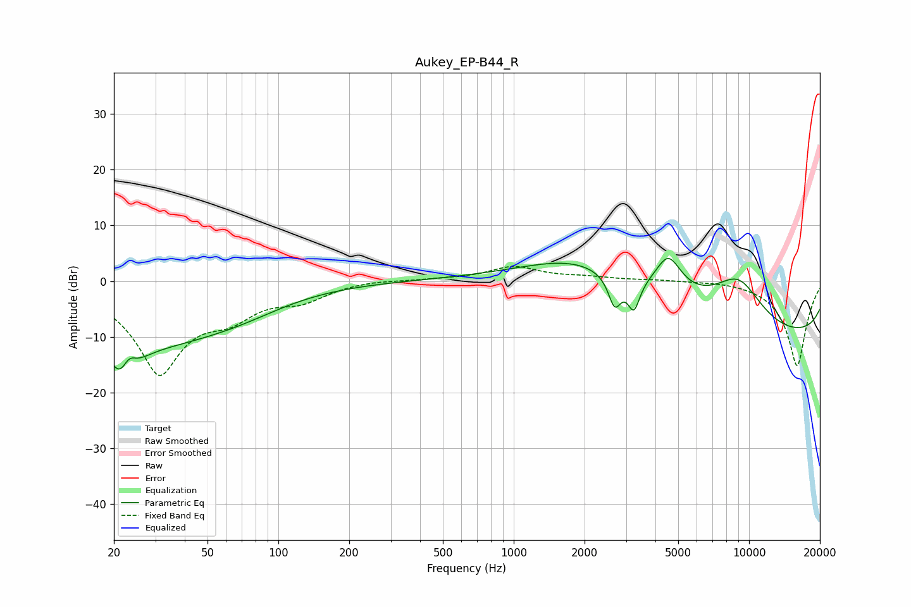

# Aukey_EP-B44_R
See [usage instructions](https://github.com/jaakkopasanen/AutoEq#usage) for more options and info.

### Parametric EQs
Apply preamp of -4.2 dB when using parametric equalizer.

|   # | Type    |   Fc (Hz) |    Q |   Gain (dB) |
|-----|---------|-----------|------|-------------|
|   1 | Peaking |        22 | 1.92 |       -11.3 |
|   2 | Peaking |        23 | 4.76 |         3.6 |
|   3 | Peaking |        34 | 0.52 |        -8.1 |
|   4 | Peaking |        68 | 0.69 |        -2.6 |
|   5 | Peaking |      1905 | 0.53 |         8   |
|   6 | Peaking |      2686 | 5.23 |        -5.5 |
|   7 | Peaking |      3241 | 5.58 |        -5.4 |
|   8 | Peaking |      4541 | 2.48 |         6.8 |
|   9 | Peaking |      9027 | 0.62 |        18.7 |
|  10 | Peaking |     10000 | 0.23 |       -20   |

### Fixed Band EQs
When using fixed band (also called graphic) equalizer, apply preamp of **-2.7 dB** (if available) and set gains manually with these parameters.

|   # | Type    |   Fc (Hz) |    Q |   Gain (dB) |
|-----|---------|-----------|------|-------------|
|   1 | Peaking |        31 | 1.41 |       -16.1 |
|   2 | Peaking |        62 | 1.41 |        -4.3 |
|   3 | Peaking |       125 | 1.41 |        -2.8 |
|   4 | Peaking |       250 | 1.41 |         0.3 |
|   5 | Peaking |       500 | 1.41 |         0.3 |
|   6 | Peaking |      1000 | 1.41 |         2.5 |
|   7 | Peaking |      2000 | 1.41 |         0.6 |
|   8 | Peaking |      4000 | 1.41 |         0.2 |
|   9 | Peaking |      8000 | 1.41 |         0.2 |
|  10 | Peaking |     16000 | 1.41 |       -15.3 |

### Graphs

