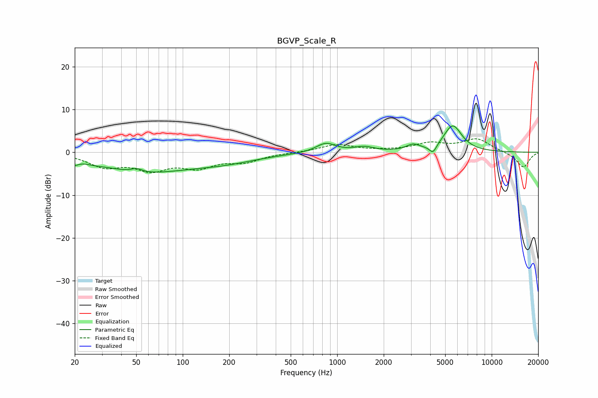

# BGVP_Scale_R
See [usage instructions](https://github.com/jaakkopasanen/AutoEq#usage) for more options and info.

### Parametric EQs
Apply preamp of -6.2 dB when using parametric equalizer.

|   # | Type    |   Fc (Hz) |    Q |   Gain (dB) |
|-----|---------|-----------|------|-------------|
|   1 | Peaking |        20 | 6    |        -1.1 |
|   2 | Peaking |        27 | 2.51 |        -0.3 |
|   3 | Peaking |        50 | 4.36 |         0.8 |
|   4 | Peaking |        56 | 0.48 |        -4.3 |
|   5 | Peaking |       187 | 0.64 |        -1.7 |
|   6 | Peaking |       844 | 2.24 |         2.2 |
|   7 | Peaking |      1495 | 2.22 |         1.1 |
|   8 | Peaking |      3099 | 3.26 |         1.4 |
|   9 | Peaking |      4171 | 5.98 |        -2   |
|  10 | Peaking |      5597 | 2.34 |         6.2 |

### Fixed Band EQs
When using fixed band (also called graphic) equalizer, apply preamp of **-3.3 dB** (if available) and set gains manually with these parameters.

|   # | Type    |   Fc (Hz) |    Q |   Gain (dB) |
|-----|---------|-----------|------|-------------|
|   1 | Peaking |        31 | 1.41 |        -3   |
|   2 | Peaking |        62 | 1.41 |        -3.6 |
|   3 | Peaking |       125 | 1.41 |        -3   |
|   4 | Peaking |       250 | 1.41 |        -2   |
|   5 | Peaking |       500 | 1.41 |        -0   |
|   6 | Peaking |      1000 | 1.41 |         1.8 |
|   7 | Peaking |      2000 | 1.41 |         0.2 |
|   8 | Peaking |      4000 | 1.41 |         1.9 |
|   9 | Peaking |      8000 | 1.41 |         3   |
|  10 | Peaking |     16000 | 1.41 |        -3.6 |

### Graphs

