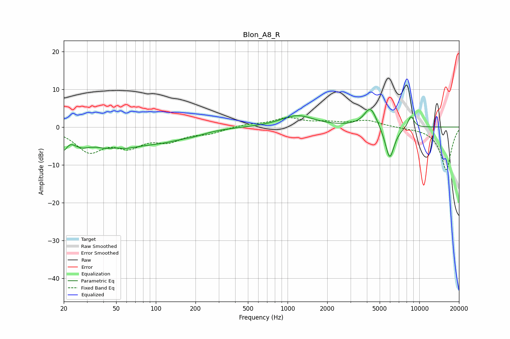

# Blon_A8_R
See [usage instructions](https://github.com/jaakkopasanen/AutoEq#usage) for more options and info.

### Parametric EQs
Apply preamp of -4.7 dB when using parametric equalizer.

|   # | Type    |   Fc (Hz) |    Q |   Gain (dB) |
|-----|---------|-----------|------|-------------|
|   1 | Peaking |        20 | 5.85 |        -3.7 |
|   2 | Peaking |        27 | 2.18 |        -2.7 |
|   3 | Peaking |        49 | 0.95 |        -5.9 |
|   4 | Peaking |        50 | 2.11 |         1.6 |
|   5 | Peaking |       111 | 0.79 |        -2.7 |
|   6 | Peaking |       195 | 1.4  |        -0.8 |
|   7 | Peaking |      1187 | 1.15 |         3   |
|   8 | Peaking |      4261 | 2.86 |         5.5 |
|   9 | Peaking |      5956 | 3.76 |        -9   |
|  10 | Peaking |      8638 | 5.32 |         3.2 |

### Fixed Band EQs
When using fixed band (also called graphic) equalizer, apply preamp of **-2.6 dB** (if available) and set gains manually with these parameters.

|   # | Type    |   Fc (Hz) |    Q |   Gain (dB) |
|-----|---------|-----------|------|-------------|
|   1 | Peaking |        31 | 1.41 |        -6   |
|   2 | Peaking |        62 | 1.41 |        -4.3 |
|   3 | Peaking |       125 | 1.41 |        -3.1 |
|   4 | Peaking |       250 | 1.41 |        -1.4 |
|   5 | Peaking |       500 | 1.41 |         0.6 |
|   6 | Peaking |      1000 | 1.41 |         2.2 |
|   7 | Peaking |      2000 | 1.41 |         1   |
|   8 | Peaking |      4000 | 1.41 |         1.7 |
|   9 | Peaking |      8000 | 1.41 |        -0.1 |
|  10 | Peaking |     16000 | 1.41 |       -11.4 |

### Graphs

