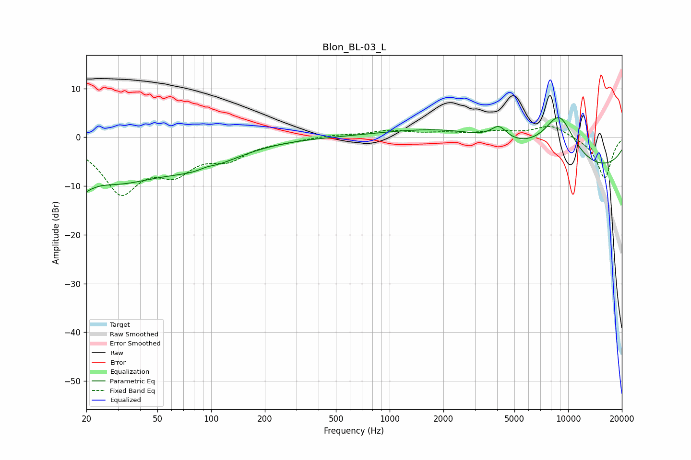

# Blon_BL-03_L
See [usage instructions](https://github.com/jaakkopasanen/AutoEq#usage) for more options and info.

### Parametric EQs
Apply preamp of -4.1 dB when using parametric equalizer.

|   # | Type    |   Fc (Hz) |    Q |   Gain (dB) |
|-----|---------|-----------|------|-------------|
|   1 | Peaking |        20 | 4.25 |        -6.9 |
|   2 | Peaking |        20 | 5.37 |         3.6 |
|   3 | Peaking |        28 | 0.51 |        -8.4 |
|   4 | Peaking |        90 | 0.68 |        -4.1 |
|   5 | Peaking |        95 | 3.4  |         0.5 |
|   6 | Peaking |      2571 | 0.41 |         4   |
|   7 | Peaking |      4093 | 3.14 |         2.7 |
|   8 | Peaking |      8749 | 0.19 |         4   |
|   9 | Peaking |      8914 | 1.31 |        10.5 |
|  10 | Peaking |     10000 | 0.21 |       -11.8 |

### Fixed Band EQs
When using fixed band (also called graphic) equalizer, apply preamp of **-2.3 dB** (if available) and set gains manually with these parameters.

|   # | Type    |   Fc (Hz) |    Q |   Gain (dB) |
|-----|---------|-----------|------|-------------|
|   1 | Peaking |        31 | 1.41 |       -10.7 |
|   2 | Peaking |        62 | 1.41 |        -5.8 |
|   3 | Peaking |       125 | 1.41 |        -3.7 |
|   4 | Peaking |       250 | 1.41 |        -0.6 |
|   5 | Peaking |       500 | 1.41 |         0.5 |
|   6 | Peaking |      1000 | 1.41 |         1.3 |
|   7 | Peaking |      2000 | 1.41 |         0.7 |
|   8 | Peaking |      4000 | 1.41 |         1   |
|   9 | Peaking |      8000 | 1.41 |         2.5 |
|  10 | Peaking |     16000 | 1.41 |        -8.5 |

### Graphs

