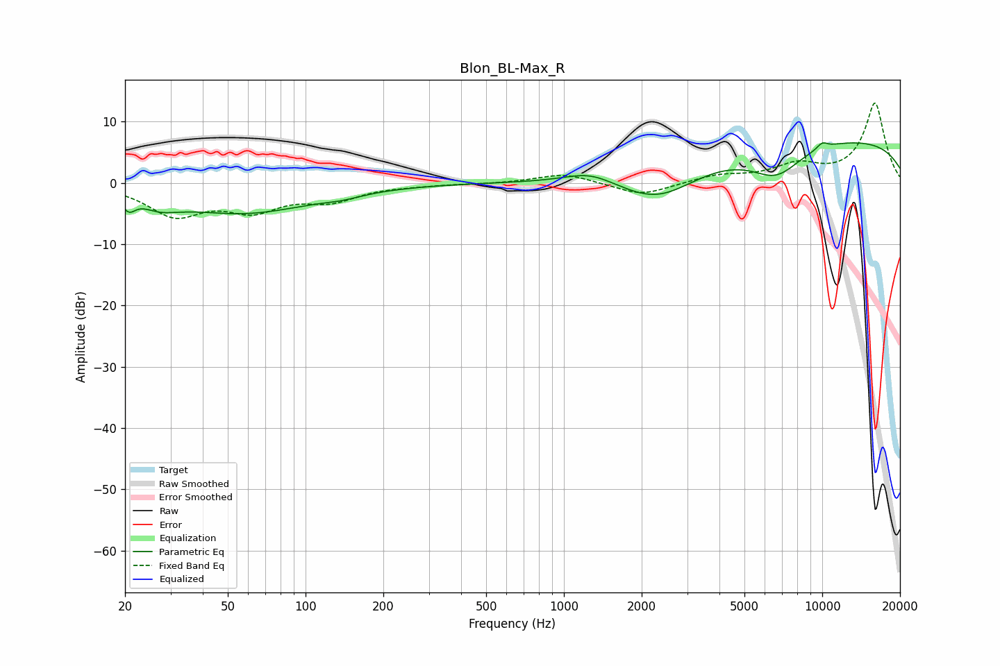

# Blon_BL-Max_R
See [usage instructions](https://github.com/jaakkopasanen/AutoEq#usage) for more options and info.

### Parametric EQs
Apply preamp of -6.6 dB when using parametric equalizer.

|   # | Type    |   Fc (Hz) |    Q |   Gain (dB) |
|-----|---------|-----------|------|-------------|
|   1 | Peaking |        21 | 5.73 |        -2.1 |
|   2 | Peaking |        28 | 2.01 |        -2.7 |
|   3 | Peaking |        29 | 2.6  |         0.9 |
|   4 | Peaking |        58 | 0.53 |        -4.8 |
|   5 | Peaking |       139 | 1.82 |        -0.6 |
|   6 | Peaking |      1264 | 1.44 |         1.9 |
|   7 | Peaking |      2310 | 0.85 |        -6.1 |
|   8 | Peaking |      6623 | 1.35 |        -4.9 |
|   9 | Peaking |      9648 | 0.18 |         7.4 |
|  10 | Peaking |     10000 | 5.78 |         1   |

### Fixed Band EQs
When using fixed band (also called graphic) equalizer, apply preamp of **-13.1 dB** (if available) and set gains manually with these parameters.

|   # | Type    |   Fc (Hz) |    Q |   Gain (dB) |
|-----|---------|-----------|------|-------------|
|   1 | Peaking |        31 | 1.41 |        -5   |
|   2 | Peaking |        62 | 1.41 |        -3.9 |
|   3 | Peaking |       125 | 1.41 |        -2.5 |
|   4 | Peaking |       250 | 1.41 |        -0.2 |
|   5 | Peaking |       500 | 1.41 |        -0.1 |
|   6 | Peaking |      1000 | 1.41 |         1.6 |
|   7 | Peaking |      2000 | 1.41 |        -2.1 |
|   8 | Peaking |      4000 | 1.41 |         1.2 |
|   9 | Peaking |      8000 | 1.41 |         2.6 |
|  10 | Peaking |     16000 | 1.41 |        13   |

### Graphs

