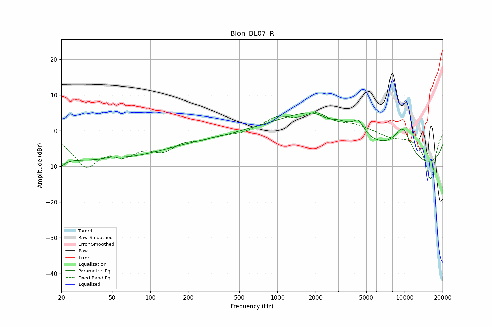

# Blon_BL07_R
See [usage instructions](https://github.com/jaakkopasanen/AutoEq#usage) for more options and info.

### Parametric EQs
Apply preamp of -5.1 dB when using parametric equalizer.

|   # | Type    |   Fc (Hz) |    Q |   Gain (dB) |
|-----|---------|-----------|------|-------------|
|   1 | Peaking |        20 | 4.49 |        -6.2 |
|   2 | Peaking |        20 | 4.84 |         4   |
|   3 | Peaking |        35 | 0.23 |        -8.2 |
|   4 | Peaking |        49 | 2.66 |         0.6 |
|   5 | Peaking |      1657 | 0.18 |        -4   |
|   6 | Peaking |      2467 | 0.38 |        15.8 |
|   7 | Peaking |      2477 | 1.92 |        -2.1 |
|   8 | Peaking |      4346 | 3.6  |         3.3 |
|   9 | Peaking |      9665 | 1.55 |         9.3 |
|  10 | Peaking |     10000 | 0.2  |       -12.2 |

### Fixed Band EQs
When using fixed band (also called graphic) equalizer, apply preamp of **-5.1 dB** (if available) and set gains manually with these parameters.

|   # | Type    |   Fc (Hz) |    Q |   Gain (dB) |
|-----|---------|-----------|------|-------------|
|   1 | Peaking |        31 | 1.41 |        -9.1 |
|   2 | Peaking |        62 | 1.41 |        -5   |
|   3 | Peaking |       125 | 1.41 |        -4.5 |
|   4 | Peaking |       250 | 1.41 |        -1.7 |
|   5 | Peaking |       500 | 1.41 |        -0.8 |
|   6 | Peaking |      1000 | 1.41 |         3.4 |
|   7 | Peaking |      2000 | 1.41 |         4.3 |
|   8 | Peaking |      4000 | 1.41 |         1.5 |
|   9 | Peaking |      8000 | 1.41 |        -1.5 |
|  10 | Peaking |     16000 | 1.41 |       -13.6 |

### Graphs

