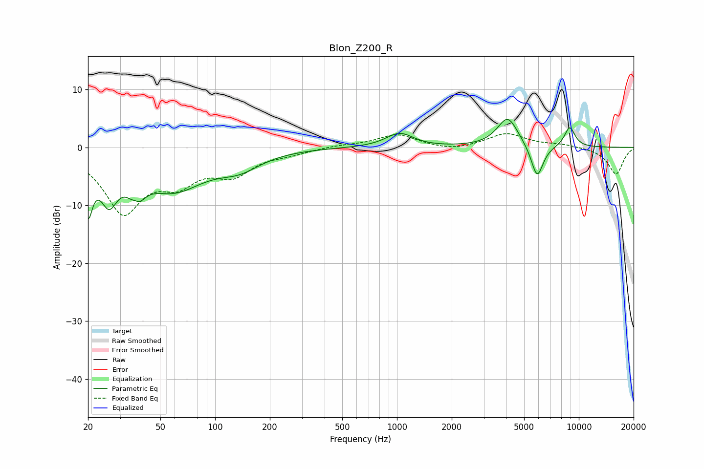

# Blon_Z200_R
See [usage instructions](https://github.com/jaakkopasanen/AutoEq#usage) for more options and info.

### Parametric EQs
Apply preamp of -4.9 dB when using parametric equalizer.

|   # | Type    |   Fc (Hz) |    Q |   Gain (dB) |
|-----|---------|-----------|------|-------------|
|   1 | Peaking |        20 | 5.68 |        -8.7 |
|   2 | Peaking |        26 | 2.96 |        -6.8 |
|   3 | Peaking |        37 | 5.47 |         3.4 |
|   4 | Peaking |        37 | 3.81 |        -6.8 |
|   5 | Peaking |        59 | 0.81 |        -6.9 |
|   6 | Peaking |       137 | 1.2  |        -2.5 |
|   7 | Peaking |      1034 | 1.89 |         2.4 |
|   8 | Peaking |      4064 | 2.42 |         5.2 |
|   9 | Peaking |      5898 | 4.09 |        -5.8 |
|  10 | Peaking |      8909 | 4.28 |         3.5 |

### Fixed Band EQs
When using fixed band (also called graphic) equalizer, apply preamp of **-2.5 dB** (if available) and set gains manually with these parameters.

|   # | Type    |   Fc (Hz) |    Q |   Gain (dB) |
|-----|---------|-----------|------|-------------|
|   1 | Peaking |        31 | 1.41 |       -10.7 |
|   2 | Peaking |        62 | 1.41 |        -4.7 |
|   3 | Peaking |       125 | 1.41 |        -4.1 |
|   4 | Peaking |       250 | 1.41 |        -0.8 |
|   5 | Peaking |       500 | 1.41 |         0.4 |
|   6 | Peaking |      1000 | 1.41 |         2.2 |
|   7 | Peaking |      2000 | 1.41 |        -0.7 |
|   8 | Peaking |      4000 | 1.41 |         2.4 |
|   9 | Peaking |      8000 | 1.41 |         0.5 |
|  10 | Peaking |     16000 | 1.41 |        -4.6 |

### Graphs

