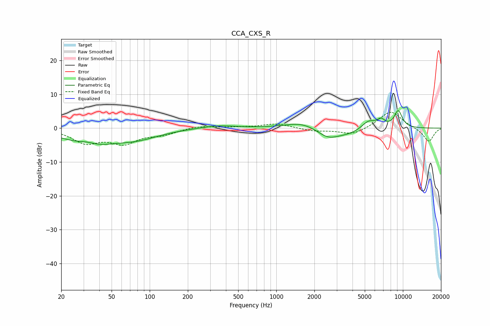

# CCA_CXS_R
See [usage instructions](https://github.com/jaakkopasanen/AutoEq#usage) for more options and info.

### Parametric EQs
Apply preamp of -5.2 dB when using parametric equalizer.

|   # | Type    |   Fc (Hz) |    Q |   Gain (dB) |
|-----|---------|-----------|------|-------------|
|   1 | Peaking |        32 | 1.92 |         1.3 |
|   2 | Peaking |        33 | 0.74 |        -4.8 |
|   3 | Peaking |        80 | 0.79 |        -2.5 |
|   4 | Peaking |       346 | 1.08 |         0.9 |
|   5 | Peaking |      1591 | 1.1  |         1.9 |
|   6 | Peaking |      2553 | 1.63 |        -2.8 |
|   7 | Peaking |      3697 | 1.26 |        -1.5 |
|   8 | Peaking |      5356 | 2.55 |         2.5 |
|   9 | Peaking |      6714 | 4.2  |         2.1 |
|  10 | Peaking |      9186 | 3.88 |         5   |

### Fixed Band EQs
When using fixed band (also called graphic) equalizer, apply preamp of **-4.8 dB** (if available) and set gains manually with these parameters.

|   # | Type    |   Fc (Hz) |    Q |   Gain (dB) |
|-----|---------|-----------|------|-------------|
|   1 | Peaking |        31 | 1.41 |        -4   |
|   2 | Peaking |        62 | 1.41 |        -4.1 |
|   3 | Peaking |       125 | 1.41 |        -1.6 |
|   4 | Peaking |       250 | 1.41 |         0.8 |
|   5 | Peaking |       500 | 1.41 |         0.2 |
|   6 | Peaking |      1000 | 1.41 |         1.3 |
|   7 | Peaking |      2000 | 1.41 |        -0.8 |
|   8 | Peaking |      4000 | 1.41 |        -2   |
|   9 | Peaking |      8000 | 1.41 |         5.2 |
|  10 | Peaking |     16000 | 1.41 |        -4.1 |

### Graphs

