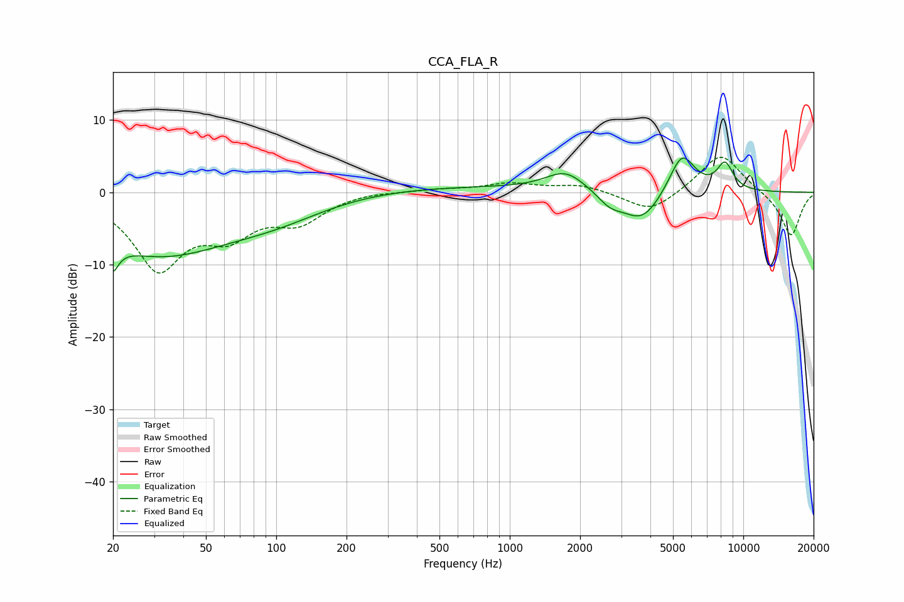

# CCA_FLA_R
See [usage instructions](https://github.com/jaakkopasanen/AutoEq#usage) for more options and info.

### Parametric EQs
Apply preamp of -4.8 dB when using parametric equalizer.

|   # | Type    |   Fc (Hz) |    Q |   Gain (dB) |
|-----|---------|-----------|------|-------------|
|   1 | Peaking |        20 | 5.53 |        -7.2 |
|   2 | Peaking |        20 | 5.72 |         3.4 |
|   3 | Peaking |        31 | 0.44 |        -8.3 |
|   4 | Peaking |       102 | 0.64 |        -2.2 |
|   5 | Peaking |       485 | 0.28 |         0.8 |
|   6 | Peaking |      1736 | 1.65 |         2.8 |
|   7 | Peaking |      2681 | 2.61 |        -1.6 |
|   8 | Peaking |      3680 | 1.62 |        -4.3 |
|   9 | Peaking |      5461 | 2.43 |         5.8 |
|  10 | Peaking |      8350 | 3.73 |         3.7 |

### Fixed Band EQs
When using fixed band (also called graphic) equalizer, apply preamp of **-4.9 dB** (if available) and set gains manually with these parameters.

|   # | Type    |   Fc (Hz) |    Q |   Gain (dB) |
|-----|---------|-----------|------|-------------|
|   1 | Peaking |        31 | 1.41 |       -10.1 |
|   2 | Peaking |        62 | 1.41 |        -4.7 |
|   3 | Peaking |       125 | 1.41 |        -3.6 |
|   4 | Peaking |       250 | 1.41 |         0.3 |
|   5 | Peaking |       500 | 1.41 |         0.4 |
|   6 | Peaking |      1000 | 1.41 |         1.2 |
|   7 | Peaking |      2000 | 1.41 |         1   |
|   8 | Peaking |      4000 | 1.41 |        -2.9 |
|   9 | Peaking |      8000 | 1.41 |         5.5 |
|  10 | Peaking |     16000 | 1.41 |        -6.2 |

### Graphs

