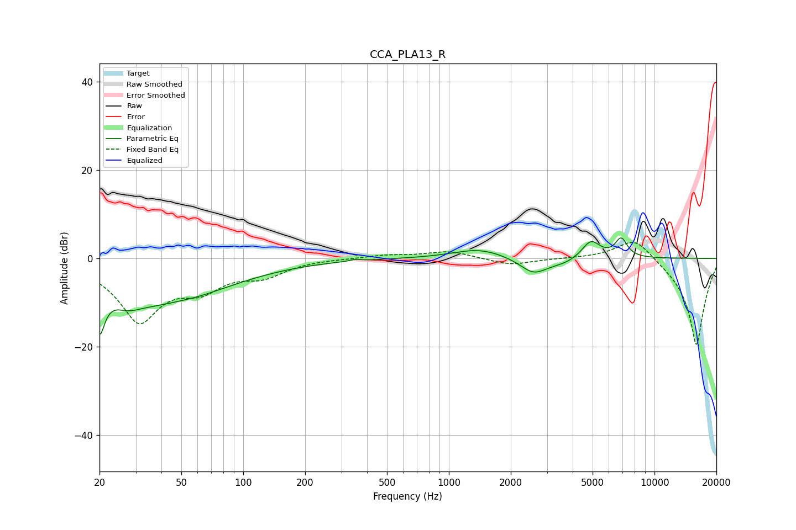

# CCA_PLA13_R
See [usage instructions](https://github.com/jaakkopasanen/AutoEq#usage) for more options and info.

### Parametric EQs
Apply preamp of -4.8 dB when using parametric equalizer.

|   # | Type    |   Fc (Hz) |    Q |   Gain (dB) |
|-----|---------|-----------|------|-------------|
|   1 | Peaking |        20 | 5.41 |       -10.1 |
|   2 | Peaking |        27 | 2.04 |        -2.7 |
|   3 | Peaking |        42 | 0.49 |       -10.3 |
|   4 | Peaking |        47 | 1.47 |         0.8 |
|   5 | Peaking |       350 | 5.97 |         0.4 |
|   6 | Peaking |      1404 | 1.13 |         2.2 |
|   7 | Peaking |      2580 | 2.11 |        -3.5 |
|   8 | Peaking |      3623 | 1.73 |        -1.2 |
|   9 | Peaking |      4907 | 3.06 |         4.2 |
|  10 | Peaking |      6886 | 4.6  |         4.2 |

### Fixed Band EQs
When using fixed band (also called graphic) equalizer, apply preamp of **-3.7 dB** (if available) and set gains manually with these parameters.

|   # | Type    |   Fc (Hz) |    Q |   Gain (dB) |
|-----|---------|-----------|------|-------------|
|   1 | Peaking |        31 | 1.41 |       -13.7 |
|   2 | Peaking |        62 | 1.41 |        -5.2 |
|   3 | Peaking |       125 | 1.41 |        -3.3 |
|   4 | Peaking |       250 | 1.41 |         0   |
|   5 | Peaking |       500 | 1.41 |         0.7 |
|   6 | Peaking |      1000 | 1.41 |         1.6 |
|   7 | Peaking |      2000 | 1.41 |        -1.6 |
|   8 | Peaking |      4000 | 1.41 |         0.1 |
|   9 | Peaking |      8000 | 1.41 |         5.4 |
|  10 | Peaking |     16000 | 1.41 |       -20   |

### Graphs

