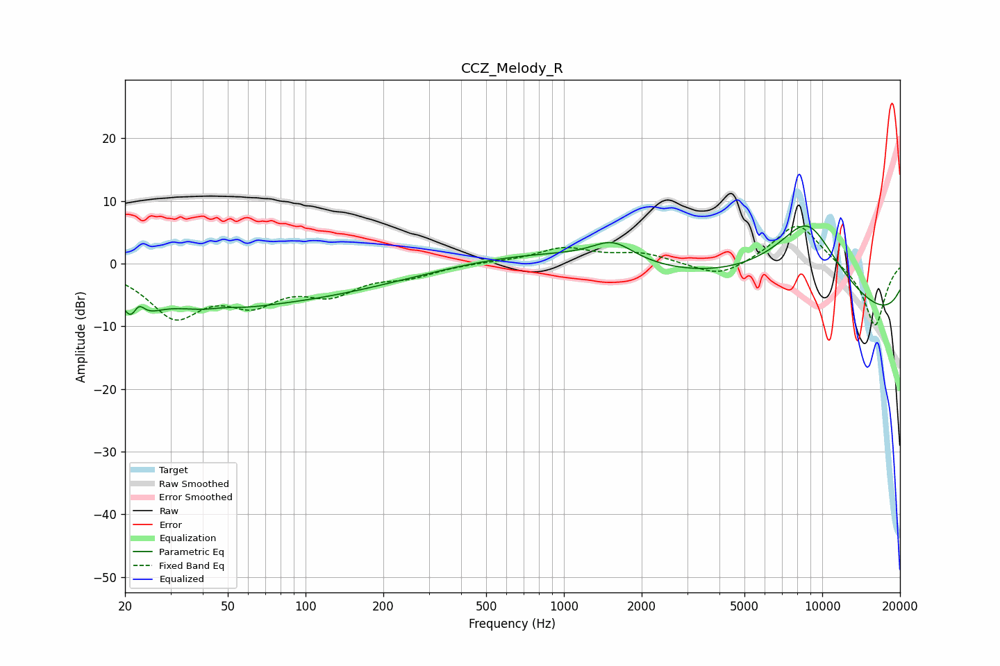

# CCZ_Melody_R
See [usage instructions](https://github.com/jaakkopasanen/AutoEq#usage) for more options and info.

### Parametric EQs
Apply preamp of -6.1 dB when using parametric equalizer.

|   # | Type    |   Fc (Hz) |    Q |   Gain (dB) |
|-----|---------|-----------|------|-------------|
|   1 | Peaking |        21 | 4.67 |        -4   |
|   2 | Peaking |        22 | 5.8  |         3.3 |
|   3 | Peaking |        24 | 2.31 |        -2.3 |
|   4 | Peaking |        45 | 1.14 |        -2   |
|   5 | Peaking |        48 | 2.03 |         1   |
|   6 | Peaking |        60 | 0.26 |        -6.1 |
|   7 | Peaking |      1549 | 1.72 |         3.2 |
|   8 | Peaking |      3146 | 0.18 |         6.1 |
|   9 | Peaking |      8745 | 0.72 |        16.7 |
|  10 | Peaking |      9078 | 0.18 |       -15.6 |

### Fixed Band EQs
When using fixed band (also called graphic) equalizer, apply preamp of **-6.0 dB** (if available) and set gains manually with these parameters.

|   # | Type    |   Fc (Hz) |    Q |   Gain (dB) |
|-----|---------|-----------|------|-------------|
|   1 | Peaking |        31 | 1.41 |        -7.9 |
|   2 | Peaking |        62 | 1.41 |        -5.1 |
|   3 | Peaking |       125 | 1.41 |        -4.1 |
|   4 | Peaking |       250 | 1.41 |        -1.7 |
|   5 | Peaking |       500 | 1.41 |         0.2 |
|   6 | Peaking |      1000 | 1.41 |         2.4 |
|   7 | Peaking |      2000 | 1.41 |         1.5 |
|   8 | Peaking |      4000 | 1.41 |        -2.5 |
|   9 | Peaking |      8000 | 1.41 |         6.8 |
|  10 | Peaking |     16000 | 1.41 |       -10.2 |

### Graphs

