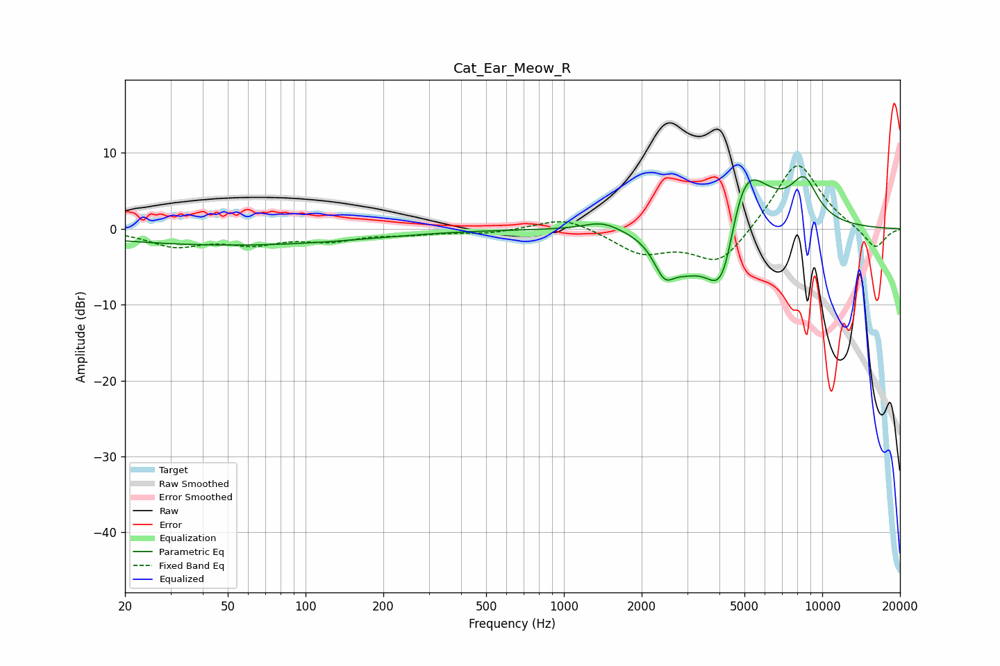

# Cat_Ear_Meow_R
See [usage instructions](https://github.com/jaakkopasanen/AutoEq#usage) for more options and info.

### Parametric EQs
Apply preamp of -7.0 dB when using parametric equalizer.

|   # | Type    |   Fc (Hz) |    Q |   Gain (dB) |
|-----|---------|-----------|------|-------------|
|   1 | Peaking |        41 | 0.26 |        -0.6 |
|   2 | Peaking |        57 | 0.27 |        -1.6 |
|   3 | Peaking |      1409 | 1.99 |         1.2 |
|   4 | Peaking |      2453 | 3.24 |        -4.6 |
|   5 | Peaking |      2941 | 2.79 |        -1.6 |
|   6 | Peaking |      3550 | 1.41 |        -5.7 |
|   7 | Peaking |      3981 | 2.9  |        -5.5 |
|   8 | Peaking |      4260 | 4.08 |        -2.9 |
|   9 | Peaking |      5004 | 1.47 |        10.6 |
|  10 | Peaking |      8514 | 2.43 |         5.2 |

### Fixed Band EQs
When using fixed band (also called graphic) equalizer, apply preamp of **-8.4 dB** (if available) and set gains manually with these parameters.

|   # | Type    |   Fc (Hz) |    Q |   Gain (dB) |
|-----|---------|-----------|------|-------------|
|   1 | Peaking |        31 | 1.41 |        -2.1 |
|   2 | Peaking |        62 | 1.41 |        -1.7 |
|   3 | Peaking |       125 | 1.41 |        -1.3 |
|   4 | Peaking |       250 | 1.41 |        -0.6 |
|   5 | Peaking |       500 | 1.41 |        -0.5 |
|   6 | Peaking |      1000 | 1.41 |         1.7 |
|   7 | Peaking |      2000 | 1.41 |        -3   |
|   8 | Peaking |      4000 | 1.41 |        -4.8 |
|   9 | Peaking |      8000 | 1.41 |         9.2 |
|  10 | Peaking |     16000 | 1.41 |        -2.8 |

### Graphs

