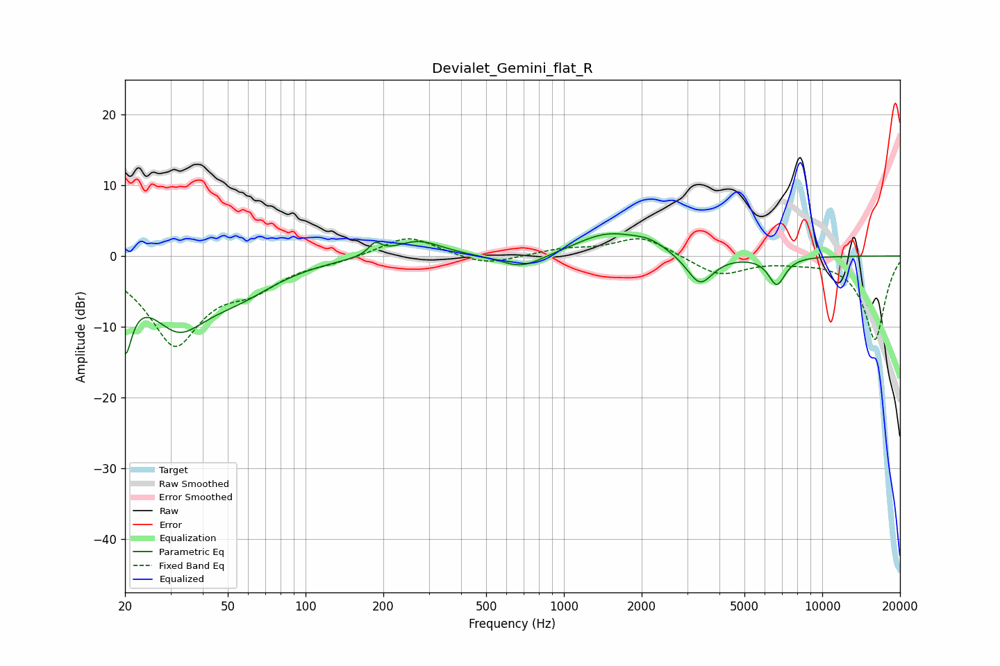

# Devialet_Gemini_flat_R
See [usage instructions](https://github.com/jaakkopasanen/AutoEq#usage) for more options and info.

### Parametric EQs
Apply preamp of -3.2 dB when using parametric equalizer.

|   # | Type    |   Fc (Hz) |    Q |   Gain (dB) |
|-----|---------|-----------|------|-------------|
|   1 | Peaking |        20 | 5.28 |        -9.6 |
|   2 | Peaking |        32 | 1.23 |        -8.5 |
|   3 | Peaking |        55 | 0.92 |        -3.9 |
|   4 | Peaking |       186 | 5.89 |         1.6 |
|   5 | Peaking |       272 | 1.52 |         2.3 |
|   6 | Peaking |       686 | 1.66 |        -2.1 |
|   7 | Peaking |      1472 | 1.14 |         3.1 |
|   8 | Peaking |      2141 | 2    |         1.3 |
|   9 | Peaking |      3361 | 2.76 |        -4.4 |
|  10 | Peaking |      6671 | 4.15 |        -4   |

### Fixed Band EQs
When using fixed band (also called graphic) equalizer, apply preamp of **-2.5 dB** (if available) and set gains manually with these parameters.

|   # | Type    |   Fc (Hz) |    Q |   Gain (dB) |
|-----|---------|-----------|------|-------------|
|   1 | Peaking |        31 | 1.41 |       -12.2 |
|   2 | Peaking |        62 | 1.41 |        -3.3 |
|   3 | Peaking |       125 | 1.41 |        -0.6 |
|   4 | Peaking |       250 | 1.41 |         3   |
|   5 | Peaking |       500 | 1.41 |        -1.4 |
|   6 | Peaking |      1000 | 1.41 |         0.9 |
|   7 | Peaking |      2000 | 1.41 |         2.8 |
|   8 | Peaking |      4000 | 1.41 |        -2.8 |
|   9 | Peaking |      8000 | 1.41 |        -0.4 |
|  10 | Peaking |     16000 | 1.41 |       -11.8 |

### Graphs

