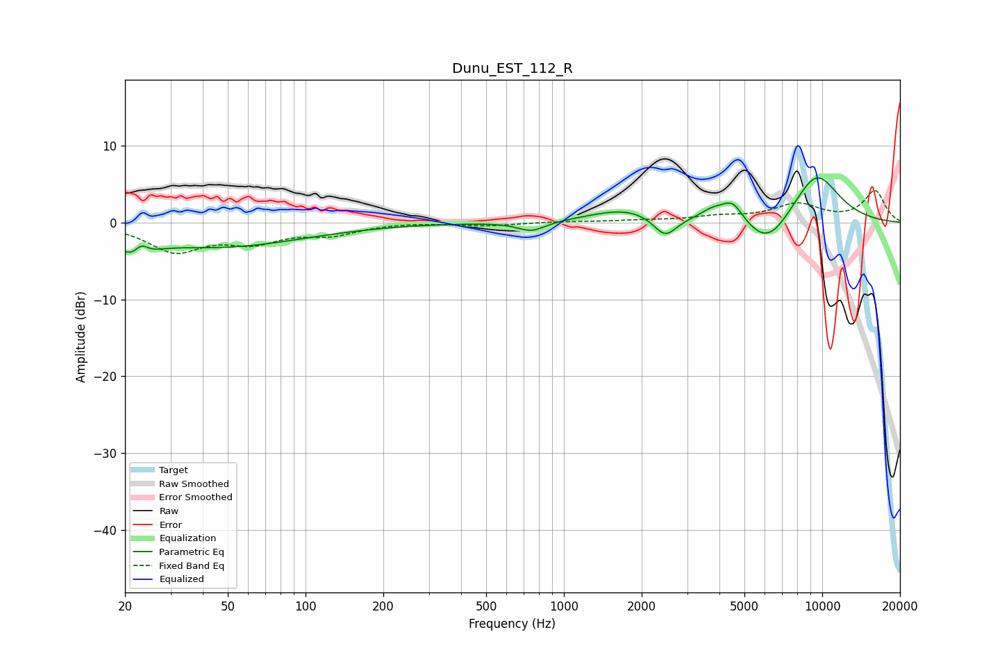

# Dunu_EST_112_R
See [usage instructions](https://github.com/jaakkopasanen/AutoEq#usage) for more options and info.

### Parametric EQs
Apply preamp of -5.9 dB when using parametric equalizer.

|   # | Type    |   Fc (Hz) |    Q |   Gain (dB) |
|-----|---------|-----------|------|-------------|
|   1 | Peaking |        22 | 2.4  |        -3.1 |
|   2 | Peaking |        23 | 5    |         2   |
|   3 | Peaking |        47 | 0.43 |        -3.1 |
|   4 | Peaking |       749 | 2.6  |        -1.3 |
|   5 | Peaking |      1740 | 1.03 |         1.7 |
|   6 | Peaking |      2465 | 3.14 |        -2.7 |
|   7 | Peaking |      3762 | 2.81 |         1.3 |
|   8 | Peaking |      4498 | 3.27 |         2.6 |
|   9 | Peaking |      6167 | 1.58 |        -4.1 |
|  10 | Peaking |      9457 | 1.32 |         6.7 |

### Fixed Band EQs
When using fixed band (also called graphic) equalizer, apply preamp of **-4.3 dB** (if available) and set gains manually with these parameters.

|   # | Type    |   Fc (Hz) |    Q |   Gain (dB) |
|-----|---------|-----------|------|-------------|
|   1 | Peaking |        31 | 1.41 |        -3.6 |
|   2 | Peaking |        62 | 1.41 |        -2.2 |
|   3 | Peaking |       125 | 1.41 |        -1.4 |
|   4 | Peaking |       250 | 1.41 |         0.1 |
|   5 | Peaking |       500 | 1.41 |        -0.4 |
|   6 | Peaking |      1000 | 1.41 |         0.1 |
|   7 | Peaking |      2000 | 1.41 |         0.2 |
|   8 | Peaking |      4000 | 1.41 |         0.7 |
|   9 | Peaking |      8000 | 1.41 |         2.3 |
|  10 | Peaking |     16000 | 1.41 |         4.1 |

### Graphs

