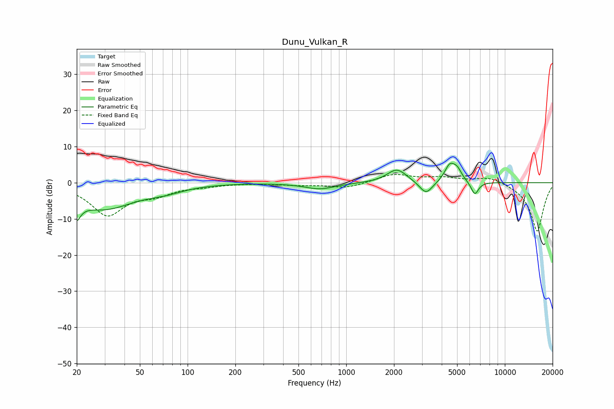

# Dunu_Vulkan_R
See [usage instructions](https://github.com/jaakkopasanen/AutoEq#usage) for more options and info.

### Parametric EQs
Apply preamp of -5.5 dB when using parametric equalizer.

|   # | Type    |   Fc (Hz) |    Q |   Gain (dB) |
|-----|---------|-----------|------|-------------|
|   1 | Peaking |        20 | 5.44 |        -8.2 |
|   2 | Peaking |        20 | 5.91 |         3   |
|   3 | Peaking |        30 | 0.71 |        -7   |
|   4 | Peaking |        72 | 1.23 |        -1.3 |
|   5 | Peaking |       684 | 1.44 |        -1.7 |
|   6 | Peaking |      2088 | 2.27 |         3.8 |
|   7 | Peaking |      3185 | 3.37 |        -3.7 |
|   8 | Peaking |      4487 | 4.26 |         4.3 |
|   9 | Peaking |      5004 | 4.64 |         2.9 |
|  10 | Peaking |      6465 | 5.82 |        -3.6 |

### Fixed Band EQs
When using fixed band (also called graphic) equalizer, apply preamp of **-2.4 dB** (if available) and set gains manually with these parameters.

|   # | Type    |   Fc (Hz) |    Q |   Gain (dB) |
|-----|---------|-----------|------|-------------|
|   1 | Peaking |        31 | 1.41 |        -8.7 |
|   2 | Peaking |        62 | 1.41 |        -2.6 |
|   3 | Peaking |       125 | 1.41 |        -0.7 |
|   4 | Peaking |       250 | 1.41 |        -0.1 |
|   5 | Peaking |       500 | 1.41 |        -0.6 |
|   6 | Peaking |      1000 | 1.41 |        -1.5 |
|   7 | Peaking |      2000 | 1.41 |         2.3 |
|   8 | Peaking |      4000 | 1.41 |         1.3 |
|   9 | Peaking |      8000 | 1.41 |         1.8 |
|  10 | Peaking |     16000 | 1.41 |       -13.6 |

### Graphs

