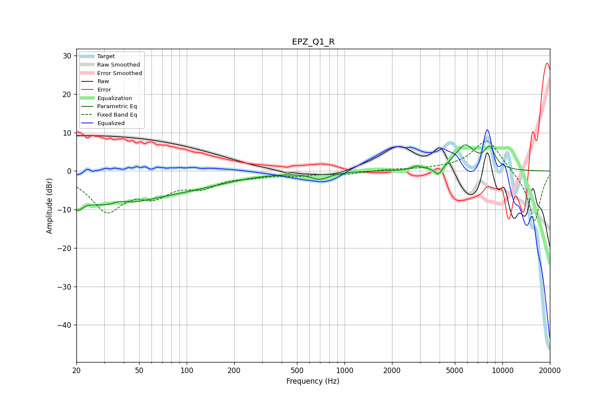

# EPZ_Q1_R
See [usage instructions](https://github.com/jaakkopasanen/AutoEq#usage) for more options and info.

### Parametric EQs
Apply preamp of -6.9 dB when using parametric equalizer.

|   # | Type    |   Fc (Hz) |    Q |   Gain (dB) |
|-----|---------|-----------|------|-------------|
|   1 | Peaking |        20 | 4.51 |        -6.9 |
|   2 | Peaking |        20 | 5.59 |         3.1 |
|   3 | Peaking |        33 | 0.54 |        -8.3 |
|   4 | Peaking |        38 | 2.91 |         1.2 |
|   5 | Peaking |       109 | 0.53 |        -2.8 |
|   6 | Peaking |       697 | 2.45 |        -1.9 |
|   7 | Peaking |      2883 | 4.75 |         0.9 |
|   8 | Peaking |      3941 | 5.87 |        -2.4 |
|   9 | Peaking |      5801 | 2.16 |         6.4 |
|  10 | Peaking |      8324 | 3.83 |         5.1 |

### Fixed Band EQs
When using fixed band (also called graphic) equalizer, apply preamp of **-7.9 dB** (if available) and set gains manually with these parameters.

|   # | Type    |   Fc (Hz) |    Q |   Gain (dB) |
|-----|---------|-----------|------|-------------|
|   1 | Peaking |        31 | 1.41 |        -9.8 |
|   2 | Peaking |        62 | 1.41 |        -5   |
|   3 | Peaking |       125 | 1.41 |        -3.4 |
|   4 | Peaking |       250 | 1.41 |        -1   |
|   5 | Peaking |       500 | 1.41 |        -0.9 |
|   6 | Peaking |      1000 | 1.41 |        -0.8 |
|   7 | Peaking |      2000 | 1.41 |         0.4 |
|   8 | Peaking |      4000 | 1.41 |         0.3 |
|   9 | Peaking |      8000 | 1.41 |         8.6 |
|  10 | Peaking |     16000 | 1.41 |       -13.4 |

### Graphs

