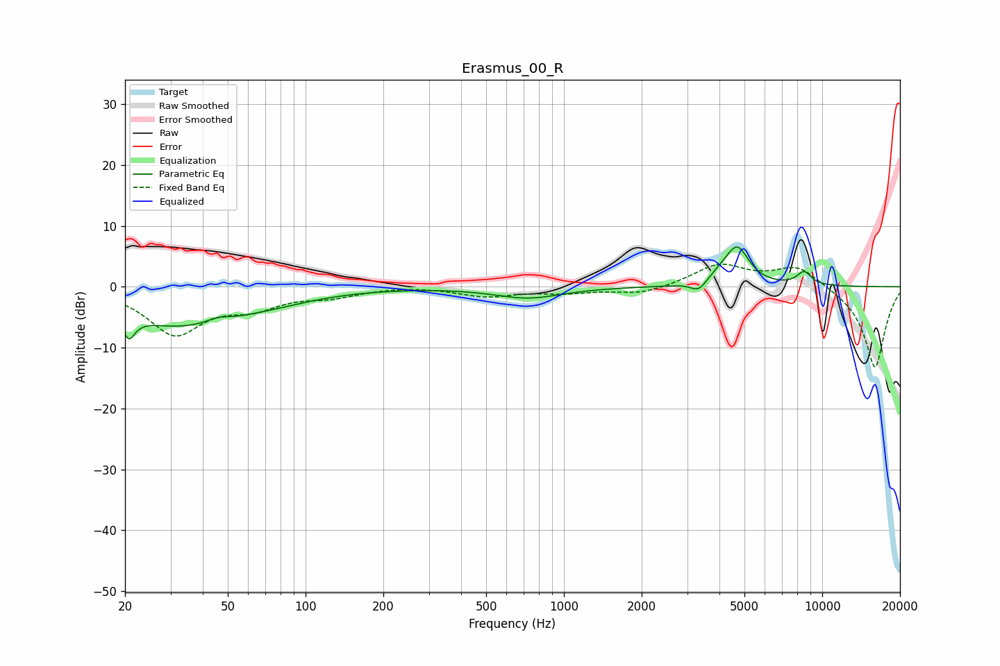

# Erasmus_00_R
See [usage instructions](https://github.com/jaakkopasanen/AutoEq#usage) for more options and info.

### Parametric EQs
Apply preamp of -6.6 dB when using parametric equalizer.

|   # | Type    |   Fc (Hz) |    Q |   Gain (dB) |
|-----|---------|-----------|------|-------------|
|   1 | Peaking |        21 | 5.8  |        -6.8 |
|   2 | Peaking |        21 | 5.8  |         3.1 |
|   3 | Peaking |        32 | 0.59 |        -6   |
|   4 | Peaking |        46 | 3.17 |         0.8 |
|   5 | Peaking |        71 | 0.73 |        -1.1 |
|   6 | Peaking |       725 | 1.09 |        -1.8 |
|   7 | Peaking |      3321 | 4.75 |        -1.7 |
|   8 | Peaking |      4063 | 2.87 |         1.1 |
|   9 | Peaking |      4693 | 3.04 |         6   |
|  10 | Peaking |      8506 | 4.56 |         2.2 |

### Fixed Band EQs
When using fixed band (also called graphic) equalizer, apply preamp of **-3.8 dB** (if available) and set gains manually with these parameters.

|   # | Type    |   Fc (Hz) |    Q |   Gain (dB) |
|-----|---------|-----------|------|-------------|
|   1 | Peaking |        31 | 1.41 |        -7.5 |
|   2 | Peaking |        62 | 1.41 |        -2.7 |
|   3 | Peaking |       125 | 1.41 |        -1.3 |
|   4 | Peaking |       250 | 1.41 |         0.2 |
|   5 | Peaking |       500 | 1.41 |        -1.5 |
|   6 | Peaking |      1000 | 1.41 |        -0.9 |
|   7 | Peaking |      2000 | 1.41 |        -1.3 |
|   8 | Peaking |      4000 | 1.41 |         3.6 |
|   9 | Peaking |      8000 | 1.41 |         3.5 |
|  10 | Peaking |     16000 | 1.41 |       -13.5 |

### Graphs

