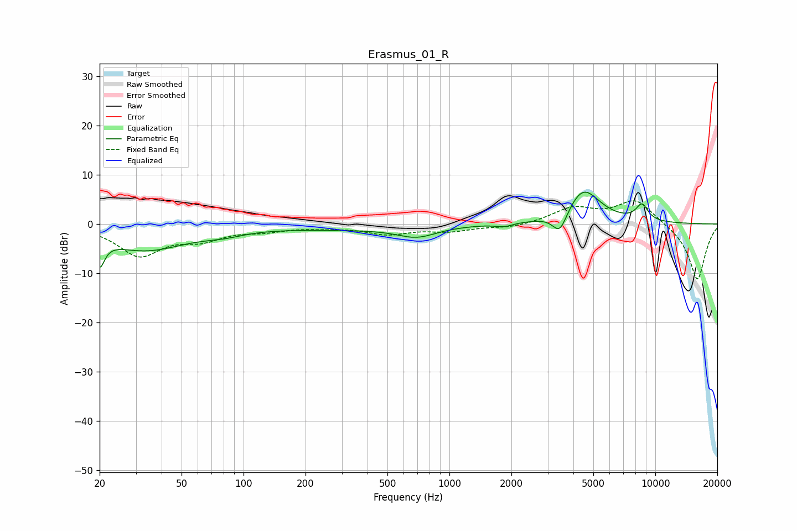

# Erasmus_01_R
See [usage instructions](https://github.com/jaakkopasanen/AutoEq#usage) for more options and info.

### Parametric EQs
Apply preamp of -6.6 dB when using parametric equalizer.

|   # | Type    |   Fc (Hz) |    Q |   Gain (dB) |
|-----|---------|-----------|------|-------------|
|   1 | Peaking |        20 | 5.96 |        -5.4 |
|   2 | Peaking |        33 | 0.7  |        -5.2 |
|   3 | Peaking |        80 | 1.45 |        -1   |
|   4 | Peaking |       289 | 0.45 |        -0.9 |
|   5 | Peaking |       694 | 1.47 |        -2.9 |
|   6 | Peaking |       695 | 1.56 |         0.7 |
|   7 | Peaking |      1837 | 3.53 |        -0.7 |
|   8 | Peaking |      3437 | 3.9  |        -4.5 |
|   9 | Peaking |      4466 | 1.7  |         7.2 |
|  10 | Peaking |      8614 | 4.32 |         3.3 |

### Fixed Band EQs
When using fixed band (also called graphic) equalizer, apply preamp of **-4.8 dB** (if available) and set gains manually with these parameters.

|   # | Type    |   Fc (Hz) |    Q |   Gain (dB) |
|-----|---------|-----------|------|-------------|
|   1 | Peaking |        31 | 1.41 |        -6.2 |
|   2 | Peaking |        62 | 1.41 |        -2.6 |
|   3 | Peaking |       125 | 1.41 |        -1.1 |
|   4 | Peaking |       250 | 1.41 |        -0.5 |
|   5 | Peaking |       500 | 1.41 |        -1.9 |
|   6 | Peaking |      1000 | 1.41 |        -1.3 |
|   7 | Peaking |      2000 | 1.41 |        -0.8 |
|   8 | Peaking |      4000 | 1.41 |         3.1 |
|   9 | Peaking |      8000 | 1.41 |         5   |
|  10 | Peaking |     16000 | 1.41 |       -11.5 |

### Graphs

